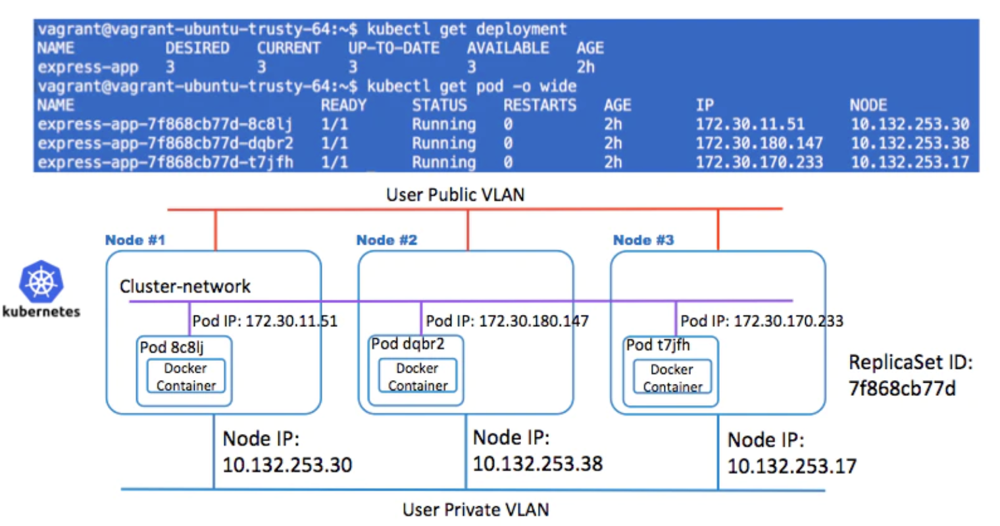
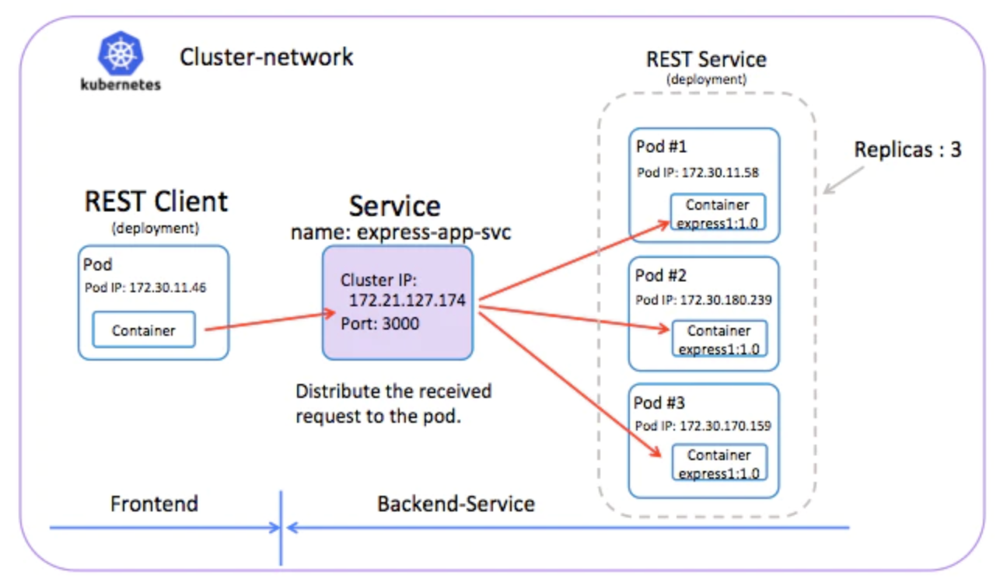

## PodとService  
コンテナ・イメージmaho/express1:1.0を kubectl で次のファイルを利用して、3つのノードから成るk8sクラスタにデプロイしたとします。
  >apiVersion: extensions/v1beta1   
  kind: Deployment   
  metadata:   
  &emsp;name: express-app   
  spec:   
  &emsp;replicas: 3   
  &emsp;template:   
  &emsp;&emsp;metadata:   
  &emsp;&emsp;&emsp;labels:   
  &emsp;&emsp;&emsp;&emsp;app: express    
  &emsp;&emsp;spec:   
  &emsp;&emsp;&emsp;containers:   
  &emsp;&emsp;&emsp;-&emsp;name: express1  
  &emsp;&emsp;&emsp;&emsp;image: maho/express1:1.0    
  &emsp;&emsp;&emsp;&emsp;ports:  
  &emsp;&emsp;&emsp;&emsp;-&emsp;containerPort: 3000   

k8sのクラスタを構成するノードに、ポッドが配置されます。ポッドはクラスタ・ネットワークのIPアドレスを持ち、そして、```ノード間を横断する様にクラスタ・ネットワークは形成されています。```そして、ノードにもIPアドレスを持っています。   

</img>  

3つのレプリカで実行されている画像処理バックエンドを考えてみましょう。これらのレプリカは代替可能なものです。フロントエンドは、バックエンドのどれを利用するか、気にしません。 一方で、```バックエンドを構成する実際のポッドは、変更されるかもしれませんが、フロントエンドのクライアントは、それらを認識したり、バックエンド自体のリストを追跡する必要はありません。```  
</img>  

### サービスの定義
サービスの転送先のポッドのセットは、普通はラベル・セレクターによって判別されます。この定義では```app: expressと同じラベルを持つレプリカ・セットのポッドたちへ```、リクエストを転送します。  
>kind: Service   
apiVersion: v1    
metadata:   
&emsp;name: express-app-svc   
spec:   
&emsp;selector:   
&emsp;&emsp;```app: express```  
&emsp;ports:  
&emsp;-&emsp;protocol: TCP  
&emsp;&emsp;port: 3000  
&emsp;&emsp;targetPort: 3000  

### 参考
> https://qiita.com/MahoTakara/items/d18d8f9b36416353066c