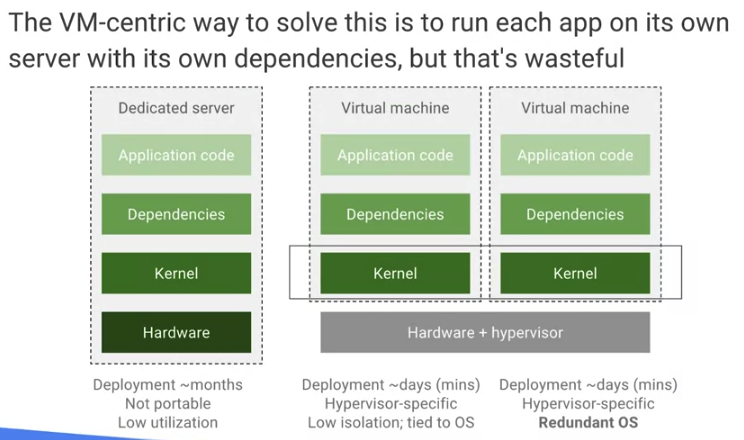
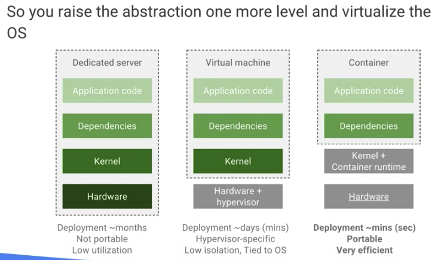
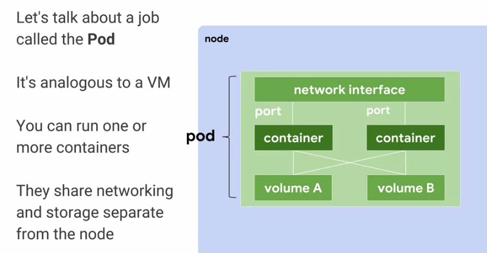
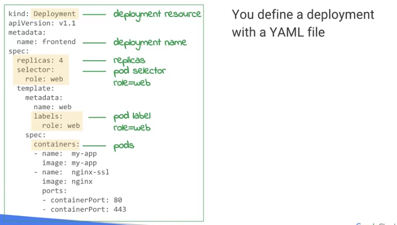
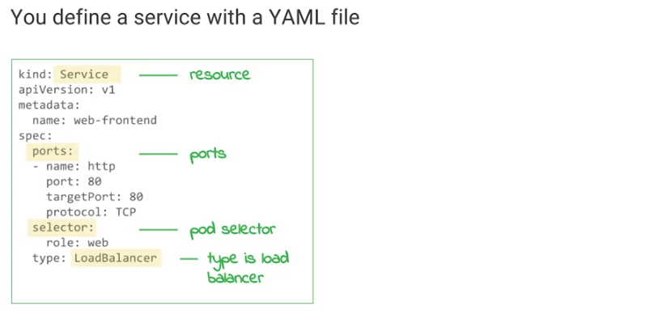
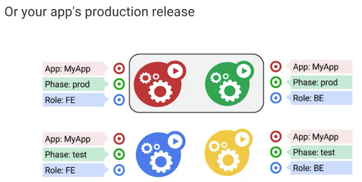
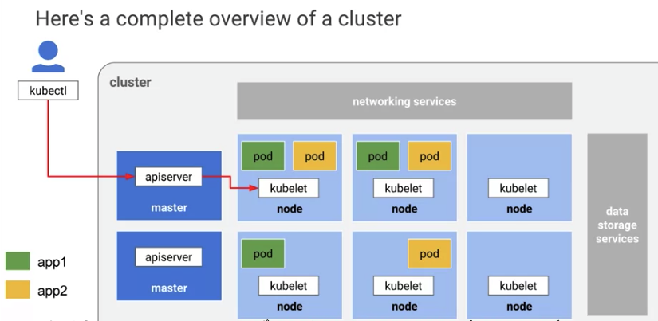
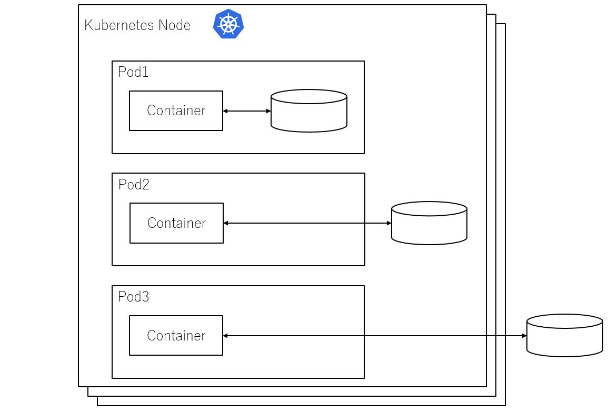
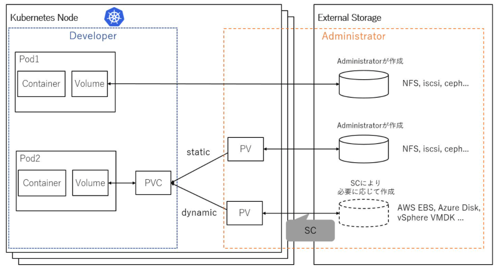

### コンテナの歴史
* もともとアプリケーションはベアメタルサーバー上にマウントされており、ハードウェア、カーネル（OS）、dependencies（ミドルウェア）などの準備が必要で非常に労力がかかっていた 
* そこで、VM-Wareのハイパーバイザ層と呼ばれる層でハードウェアとアプリを分離することで、アプリをハードウェアと分離させることができた。 
* しかし、問題点として、依存関係が異なる同じアプリの複数バージョンを単一のVMにデプロイできないという問題があった。 
* 複数バージョンをデプロイする場合は、カーネルを複製する必要があり、コスト的に非効率だった。 
  </img>  
* そこで、コンテナと呼ばれるカーネルとランタイムを収容したイメージデータを構築することで依存関係を分離し、移行も容易になった。 
  </img> 

### k8s
* k8sはマスターノードとワーカーノードで構築されている。   
  ワーカーノードは数千個、マスターノードは多数で構成され、3ゾーンをまたいで　構築できる 
</img>   

* podはVMのようなもので、1つ以上のコンテナとそれに付随するボリュームとNICで構成されている   
* podの下にOS、ハードディスク、物理NICが存在し、外部のIPアドレスと内部のIPアドレスは別々に確保される  
</img>   

* podはYAMLファイルを使って利用イメージやVMのスペックなどを定義される。   
* replicasとは、デプロイするpodの数で定義された数以下の場合は、新しいpodを起動する
</img>   

* フロントエンドやバックエンドなど、複数のレイヤーでk8sを使う場合、ロードバランサーを利用することがある、その場合はselectorでpodの種類（role）を指定した後に、「type」でLoadbalancerを指定する  
</img>   

* Labelを利用すると、podの検索、一括操作、分類分け、個数のマッピングなどは必要な処理を必要なpodに対して適切に実行することができる  
</img>   

* podをkubeleが常に監視して、問題があった場合はヘルスチェックを行う、podは問題が発生した場合は自分で再起動を行い復旧を測る  
* kubeletはクラスター内の各ノードで実行されるエージェントです。各コンテナがPodで実行されていることを保証します。  
* kubeletは、さまざまなメカニズムを通じて提供されるPodSpecのセットを取得し、それらのPodSpecに記述されているコンテナが正常に実行されている状態を保証する。kubeletは、Kubernetesが作成したものではないコンテナは管理しない。  


* podはワーカーノードに対して単一でも、複数でも問題はない。podが増えたことで、kubeletが増えることはない 
</img>   

#### k8sのボリュームアーキテクチャ
* podのデータ管理の候補は以下三つの方法が考えられる 

  1.Pod内で一時的に利用可能なディスク領域を使用する方法です。Podを削除すると保存されていたデータも一緒に削除されるため、データの永続化はできません。  
  2.Podを動かしているKubernetes Nodeのディスク領域をPodにマウントする方法です。Podを削除してもデータはNodeに残るため、データの永続化が可能です。しかし、 Pod が別ノードで動作した場合にはデータの再利用ができないデメリットが存在します。   
  3.コンテナを動かしているKubernetes Nodeとは別にiSCSIやNFS、クラウドプロバイダーの外部ストレージを利用する方法です。Podを削除してもデータは外部ストレージに残るため、データの永続化が可能です。また、Pod が別ノードで動作したとしてもデータが外部に存在するためデータの再利用が可能です。  
  →3.の方法が一番再利用性も高く、多数ノードのデータ管理に適している
  </img>   

  Volumeの機能として、あらかじめ用意したボリュームをPodから利用することが可能です。そのため、Developerは外部ストレージを指定することでPodに永続的なボリュームを接続することができます。しかし、ボリュームの作成/削除といった操作はAdministratorが行う必要があります。ここで述べるDeveloperとは、Podを作成・利用するアプリケーション開発者などを対象とし、AdministratorはKubernetesクラスター管理者、インフラ管理者を対象としています。具体的に利用可能なボリュームは、NFSやiSCSI、Cephなどが挙げられます[1]。Volumeを利用するにはPod作成時にストレージサービスのボリューム名などの情報を直接設定しなければなりません。そのため、Podとストレージが密結合となってしまい、コンテナならではの可搬性が損なわれ、環境依存となってしまうといった問題が生じます。   
  
  </img>   
  この問題に対して、Persistent Volume(PV)、Persistent Volume Claim(PVC)を用いることでPodとストレージの関連付けを抽象化して疎結合な運用が可能となります[2]。PVは外部のボリュームを抽象化するリソースです。あらかじめ作成しておいた外部ストレージのボリュームをKubernetes上にPVリソースとして登録することで、Podから利用することが可能になります。PVにはボリュームサイズやアクセスモードを指定することができます。PVCはコンテナが利用するボリューム要件を指定する仕組みです。ボリューム要件にはボリュームのサイズやアクセスモードを指定します。Podデプロイ時にPVCを指定することで、要件に合うPVをPodから利用することが可能になります。  
  PVとPVCを用いることで、DeveloperとAdministratorの役割を分離することが可能になりますが、PVは事前に用意する必要があるため、新たなワークロード作成時にはAdministratorが作成しなければなりません。

  この問題に対して、PVを動的に管理する仕組みとしてDynamic Volume Provisioningを利用することができます。Dynamic Volume ProvisioningはStorage Class（SC）を介して、PVCで指定された要件に応じてバックエンドにあるストレージシステムからボリュームを自動的にプロビジョニングする仕組みです[3]。SCのprovisionerとして適切なドライバを指定することでAWS EBS、Azure Disk, vSphere VMDK等を対象にボリュームの動的作成・割り当てを行うことが可能です。 
  > https://www.netone.co.jp/knowledge-center/netone-blog/20191206-1/

#### k8sのヘルスチェック
  Kubernetes では、```readiness プローブと liveness プローブ```を使用したアプリケーションのモニタリングに対応しています。ヘルスチェックは、ポッド内の各コンテナで実行できます。```readiness プローブは、ポッドがトラフィックに対応する「準備ができている」ことを確認するためのもので、liveness プローブは、コンテナが「正常」であることを確認するためのもの```です。liveness プローブが複数回失敗すると、コンテナは再起動されます。liveness プローブの失敗が続くと、ポッドがクラッシュ ループに陥る原因となります。readiness のチェックが失敗した場合、コンテナは「準備ができていない」とマークされ、すべてのロードバランサから削除されます。   

