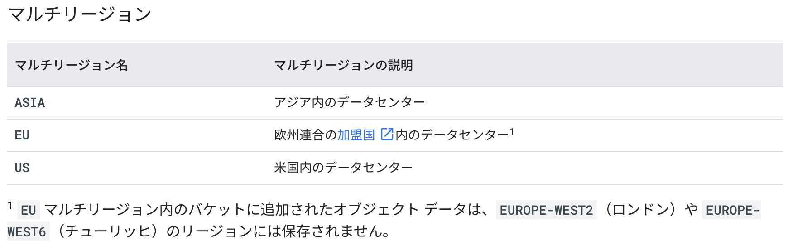
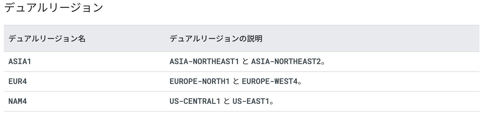
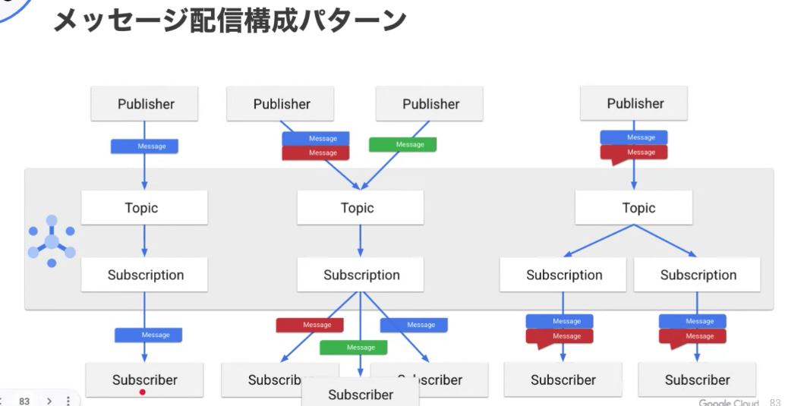

### CloudStorageの冗長化
</img>  
</img>   

### 課金の通知
* メール通知アラートの受信者は次の方法で指定できます。  
* ロールベースのオプション（デフォルト）を使用すると、Cloud 請求先アカウントの課金管理者とユーザーにメール通知アラートを送信できます。  
* Cloud Monitoring を使用して、組織内の他のユーザー（プロジェクト マネージャーなど）を指定して、予算アラート メールを送信できます。 

### MySQL
```Database Migration Service（DMS）```を利用することで、ダウンタイムを最小限に抑え、本番環境のデータベースを Cloud SQL に簡単に移行できます。このサーバーレス化により、移行のためのリソースをプロビジョニング、管理、モニタリングする手間を省くことができます。```DMS は、MySQL と PostgreSQL のネイティブなレプリケーション機能```を活用して、移行の忠実性と信頼性を最大化します。また、Cloud SQL への同等なネイティブ移行は追加料金なしで利用できます  

### CloudSQLのバックアップ
  * オンデマンド バックアップ   
      バックアップはいつでも作成できます。そのため、データベース上でリスクの高いオペレーションを実行しようとしている場合や、バックアップ時間枠まで待機することなくバックアップを作成することが必要な場合でも、不都合が生じることはありません。オンデマンド バックアップは、インスタンスで自動バックアップが有効であるかどうかにかかわらず、すべてのインスタンスで作成できます。   
      ```オンデマンド バックアップは、自動バックアップと異なり、自動的に削除されません。``` 明示的に削除するか、インスタンスが削除されるまで維持されます。

  * 自動バックアップ  
      自動バックアップでは ```4 時間のバックアップ時間枠が使用されます。```バックアップは、バックアップ時間枠内に開始されます。可能な場合は、インスタンスのアクティビティが最も少ない時間帯にバックアップをスケジュールしてください。   
      インスタンスが停止すると、追加の自動バックアップが作成され、インスタンスが停止する前にすべての変更が保護されます。デフォルトでは、```最新の 7 件のバックアップが保持されます。```インスタンスが 36 時間以上停止されている場合、自動バックアップは停止します。   


### スナップショットの作成
データが破損する可能性があるため、```実行中のスナップショットを作成することはGoogleでは決して推奨されていません。```常にインスタンスを停止してスナップショットを取る必要があります。 

### プライベートネットワーク
RFC 1918 により、内部で（つまり、組織内で）使用するために割り当てられる IP アドレスが指定され、インターネット上ではルーティングされません。具体的には次のようなものがあります。 
* 10.0.0.0/8  
* 172.16.0.0/12 
* 192.168.0.0/16  

### pub/subの構成パターン
</img>   