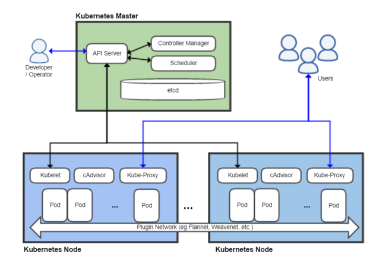
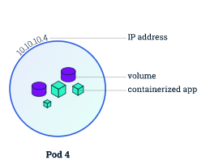
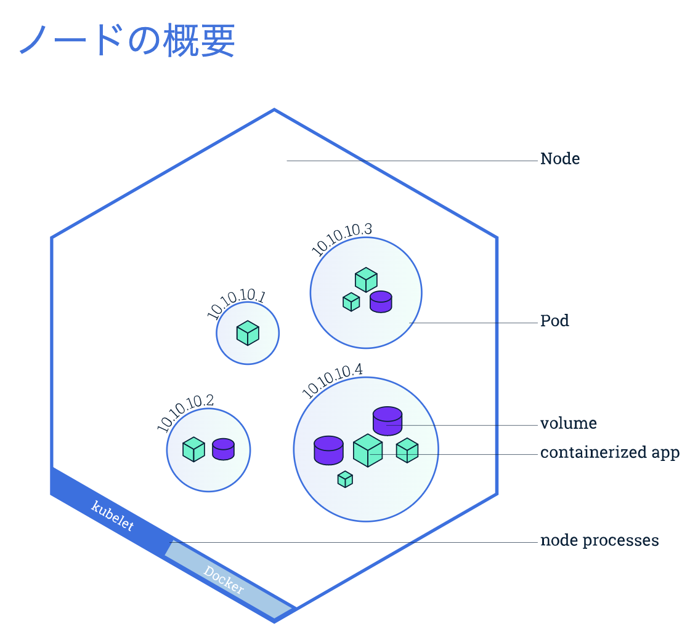
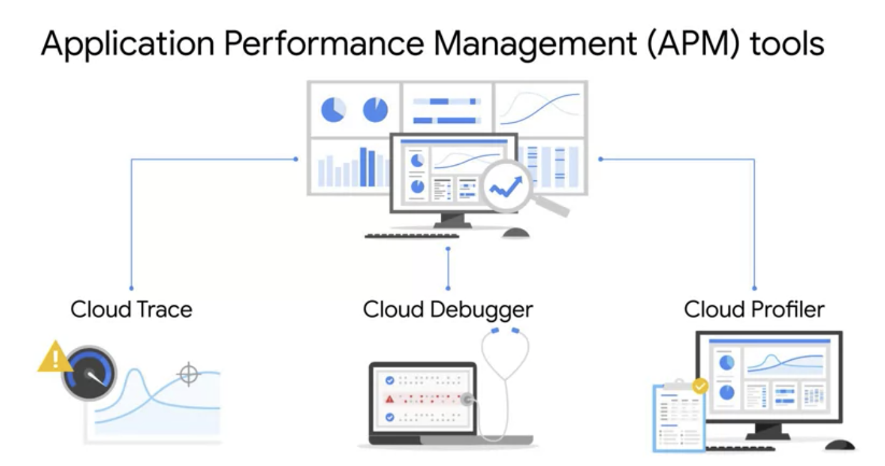
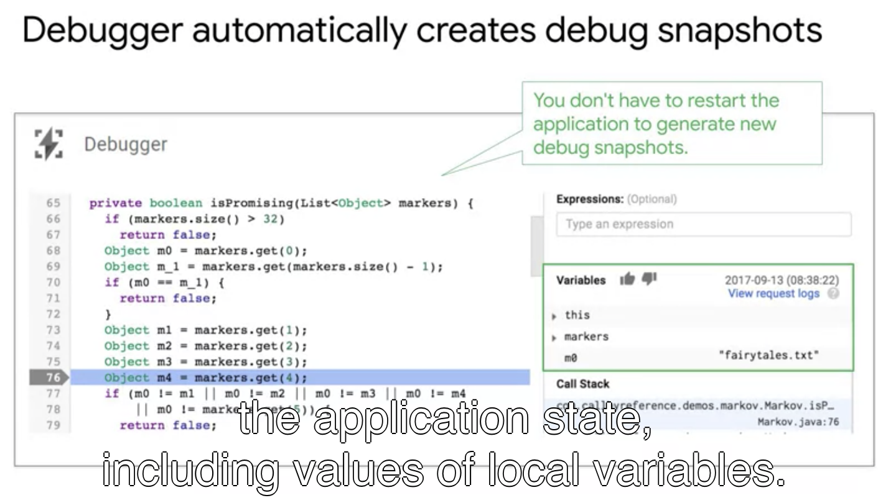
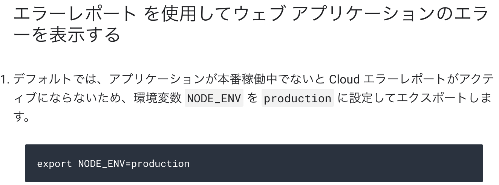

# レクチャーやクエストで学んだことの備忘録

### Deploying the Application into Kubernetes Engine
</img>
  * ポッド  
    1つ以上のアプリケーションコンテナとそれを利用できるようにする付随コンポーネントの集合   
    含まれるもの：  
      * 共有ストレージ(ボリューム)
      * ネットワーキング(クラスターに固有のIPアドレス)
      * コンテナのイメージバージョンや使用するポートなどの、各コンテナをどう動かすかに関する情報  
   </img>   
  * ノード   
    複数のPodを持つことができ、Kubernetesマスターはクラスター内のノード間でPodのスケジュールを自動的に処理します。マスターの自動スケジューリングは各ノードで利用可能なリソースを考慮に入れます。
    含まれるもの：
      * Kubelet: Kubernetesマスターとノード間の通信を担当するプロセス。マシン上で実行されているPodとコンテナを管理します。
      * レジストリからコンテナイメージを取得し、コンテナを解凍し、アプリケーションを実行することを担当する、Dockerのようなコンテナランタイム。
  </img>   

### Application debugs
  * アプリケーションのデバッグツール（APM）は三種類ある
    1.  CloudTrace
    2.  CloudDebbuger
    3.  CloudProfiler 
  </img>   
    * 共通の目的  
      ・  マルチクラウドでの統合的な監視  
      ・  収集されたデータ量のみに基づいた料金  
      ・  無料利用枠の提供  
    * CloudTraeの特徴  
      ・  全てのAPトレースを自動的に分析してレイテンシのレポートを生成する  
      ・  全てのVMSコンテナからAPトレースをキャプチャできる 
      ・  APの最近の変更によるパフォーマンスへの影響を自動的に識別する  
      ・  SDKはjava,no ducchies ruby,goで利用ができる   
      ・  CloudTraceは以下を調べることができる  
        * アプリケーションが特定のリクエストを処理するのにどのくらい時間がかかりますか？  
        * アプリケーションがリクエストを処理するのに時間がかかるのはなぜですか？  
        * 一部のリクエストに他のリクエストよりも時間がかかるのはなぜですか？  
        * アプリケーションへのリクエストの全体的なレイテンシはどのくらいですか？  
        * アプリケーションのレイテンシーは時間の経過とともに増加または減少しましたか？  
        * アプリケーションの依存関係は何ですか？  

      ・  クラウドトレースはエージェントがトレースデータを収集しGCPコンソールで見える化している   
      ・  日次分析ぺおんでは7日前と1日前のレイテンシーデータを比較できる
    *  CloudProfilerの特徴  
      ・  CPUとヒープを監視して、非効率なアプリケーションのボトルネックを見える化・改善して、リソース消費を削減できる   
      ・  コードのパフォーマンス向上を促進させるサービス  
      ・  CPUまたはメモリを大量消費する機能の呼び出し階層を見える化し、開発者がどのパスが最も多くリソースが消費されているかを気づく事書出る   
      ・  利用にはえージョンとをマシンにインストールが必要（ソースコードでライブラリをアタッチ）  
      ・  同じデプロイメント（VMなど）に10個のアプリケーションがある場合は、10このエージェントインストールが必要  
      ・  CPUのデータ収集時のCPU使用率は全体の5%未満  
    * CloudDebuggerの特徴
      ・  エラーがある行にスナップショットを自動作成する  
      ・  APが再びエラーに遭遇した場合次のスナップショットを作成する  
        →エラー箇所に付箋を貼ってくイメージ
        </img>
      ・  スナップショットがある行を選択して移動することができる
  * 補足  
  デフォルト設定では、エラーレポートは本番環境でないと利用できないので、環境変数のエクスポートが必要
  </img>

### Indevelopment:Add performance tests
  * 監視設計  
  ・  パフォーマンスは開発と本番で監視することが大事  
  ・  アプリケーションを変更してもパフォーマンスが低下しないことを確認する  
  * 開発環境  
  ・  ハードパフォーマンステストを開発で行い、早期にリソース枯渇などの検出する  
  ・  パッフォーマンスウォッチポイント（=ブレークポイント）を作成して、ある静止点でのリソース状況を観測する 
  ・  chromedev：Webページを手動で分析するためのページ速度の洞察を備えたツール  
  ・  エラー時は指数バックオフでリトライする  
  * 本番環境  
  ・  以下観点を確認する  
    *  外部ユーザーの負荷  
    *  最も頻繁なリクエストの分析 
    *  最も遅いリクエスト 
  ・ アプリケーションのトラフィック量に応じた自動スケーリングポリシーを設定して不可分散していることを確認 
  ・  待ち時間を短縮するために、適切なリージョンにリソースをデプロイする  

  ### 演習の学び
  * sourceコマンドを実行することで、kubectlのコマンドをTABで保管してくれるようになる
    > ```source <(kubectl completion bash)``` 
  * kubectl createで対象imageのコンテナインスタンスを起動できる 
    > ```kubectl create deployment nginx --image=nginx:1.10.0```  
    >Kubernetes では、コンテナはすべてポッドで実行されます。このコマンドでは、バックグラウンドで Deployment と呼ばれるものが作成され、nginx コンテナを含む単一のポッドがそこで実行されます。Deployment は、ポッドが実行されているノードで障害が発生した場合でも、指定した数のポッドを稼動状態に保ちます。ここではデフォルトの数、つまり 1 つのポッドを実行しています。  

  * kubectl expose コマンドを使用して、nginx コンテナを Kubernetes の外部に公開します。 
    >```kubectl expose deployment nginx --port 80 --type LoadBalancer```  
    > Kubernetes によって、サービスと、パブリック IP アドレスが割り当てられた外部ロードバランサが作成されました（サービスについては後で学習します）。この IP アドレスは、サービスが存続している間は変更されません。このパブリック IP アドレスにアクセスするクライアント（エンドユーザーや別のコンテナなど）は、サービスの背後にあるポッドにルーティングされます。この場合は nginx ポッドです。  

  * ポッドの実行中に、kubectl describe コマンドを使用して monolith ポッドの詳細情報を取得します。 

     > ```kubectl describe pods monolith```   
    > ポッドの IP アドレスやイベントログなど、monolith ポッドに関する多くの情報を確認できます。この情報はトラブルシューティングの際に役に立ちます。   

  

