# レクチャーやラボで学んだことの備忘録

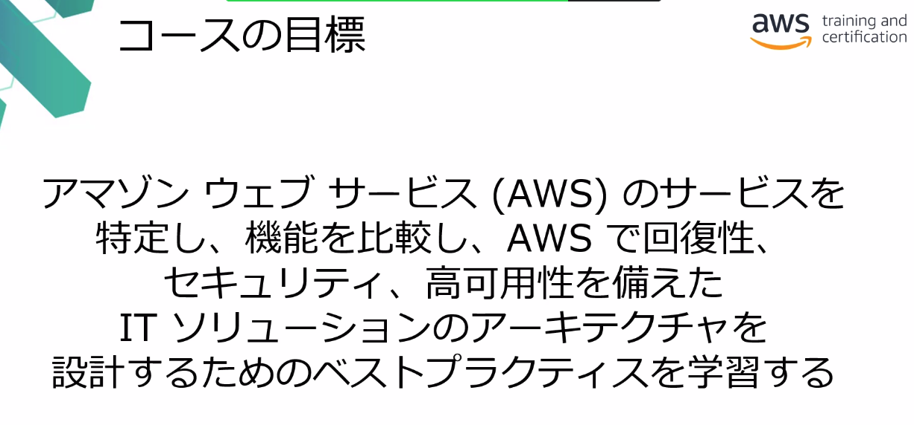</img>
<br>

- `障害に強く、変更しやすく、スケーラブルでセキュリティが守られた`システムを作る
- 各リソースが`どの単位で冗長化されているのか（AZ、リージョン冗長など）`を理解する

## 疑問点

Q. ワークロードってなに？
A. 使い道や、ある目的を持ったシステム

Q.外部の AWS アカウントに跨いでスイッチロールできるのか？
A.できる。IAM の信頼関係で外部の AWS アカウントを許可することで、自分の AWS アカウント上のロールを割り当てることができる。

Q.プライベートサブネットに存在する EC2 をインターネットに接続させるために NAT ゲートウェイ作る際、なぜパブリックサブネット上に作る必要があるのか？
A.NAT ゲートウェイはインターネットに繋ぐための機能であるため、外部と接続するネットワークであるパブリックサブネット上に作成する。

## 試験までに勉強すること

- File サービスのワークロードの違い
- DataSync、DataGateway のワークロードの違い
- Cloud Watch と CloudTrail の違い
- AutoScalling Group を理解する

## 1.アーキテクチャ設計の基礎

### ミッション

- クラウドリソースへのアクセス制御方法
- ベストプラクティスに従ってインフラを構築できているか確認する方法

### クラウドリソースを使うメリット

- インフラ整備に必要なコストや品質担保を AWS にやってもらって、利用者は自社のドメインビジネスに注力する
  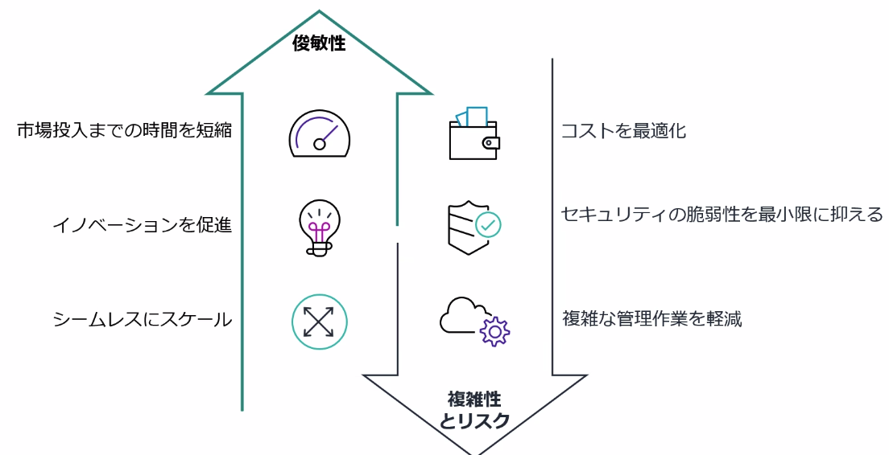</img>
  <br>

### AWS のリソース一覧

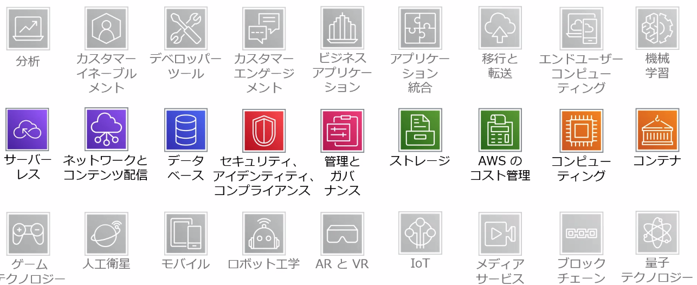</img>
<br>

### SolutionArchitect の責務

- `障害に強く、変更しやすく、スケーラブルでセキュリティが守られた`システムを設計できる
- 要件を満たすアーキテクチャを AWS リソースを用いて構築できる
- ビジネスニーズと要件に合わせてソリューションを分析する

### AWS のサービス接続図

- AWS の全てのリソースを内部で`APIを呼び出して操作`している
  - API を使うことで、API のエンドポイントを`誰が何を使えるか`の認証認可をコントロールできる
  - 利用者側は利用インターフェースを意識しなくても同じ API を利用することができる（＝インターフェース切り替えなどの`変更に強くなる`）
    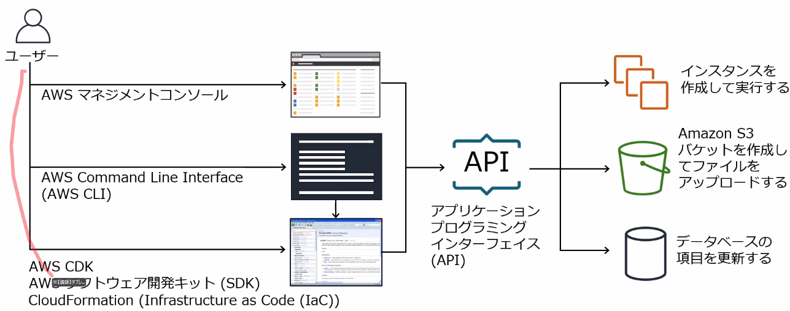</img>
    <br>

### マネージドサービス

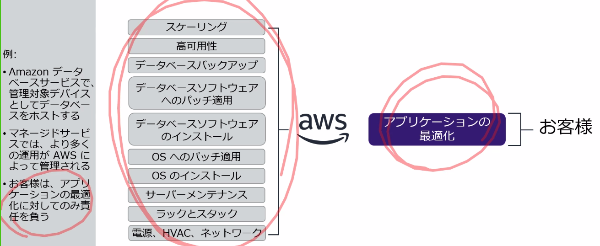</img>
<br>

- サーバーレスは`VPCインフラストラクチャ内で実行されない`
- VPC ベースのリソース（Ex.VPC 内の EC2）からサーバーレスサービスを呼び出すことができる
- エンドポイント URL を用いてサービスにアクセスすることができる

### グローバルインフラ

- データセンター内の数千台のサーバーは全てアクティブで稼働している
- データセンター内の NW は AWS 独自のプロトコルを使っている
- アベイラビリティゾーン（AZ）
  - 同じリージョン内の複数データセンター冗長化している
  - EBS（=AZ 対応している EC2）は、データセンター冗長されて可用性が高い
  - 地域だけでなく、`電力供給会社でも冗長化`している
- リージョン
  - 全部で 27 箇所存在してそのうち 23 箇所を使うことができる
  - 使えない 4 箇所は、US 政府リージョン、中国リージョンが 3 箇所
  - 最近大阪リージョンができた
  - もともとインターネットが使われていたが最近は`全て専用線で通信`されている
  - 同じリージョン内は 1ms 以下で通信を保証している
- 【大事】リージョンの選定方法
  1. 自社のガバナンスで許容されている国に属するリージョンか
  2. レイテンシーが自社システムで許容可能な範囲内か
  3. 特殊なサービスがリージョンに対応しているか（人工衛星のサービスは特定リージョンのみ利用可能）
  4. リージョン利用コストが許容できるか（US が安い、日本は真ん中くらい）

### AWS Local Zones

- US のような国土が広い国で、AZ ではレイテンシーが担保できないようなインタラクティブなサービスを取り扱いたい場合で、さらに範囲を絞った DC でシステム運用を行いたい時に使う
  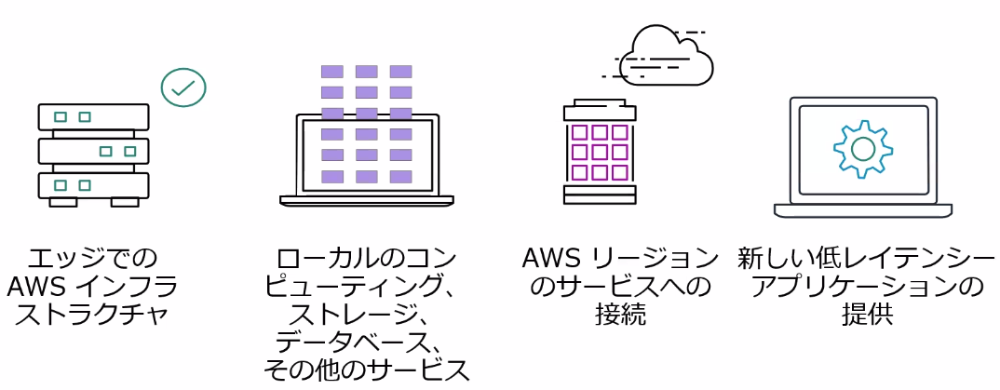</img>
  <br>

### エッジロケーション

- 地理が離れた DC にコンテンツが保存してある場合は、お客の最寄りの DC にデータをキャッシュして`誰がみても同じ速度でコンテンツを閲覧することができる`環境を提供する
- サポートしている機能は、`動画、写真などの静的コンテンツ、及びDNS`を提供している
  <br>
  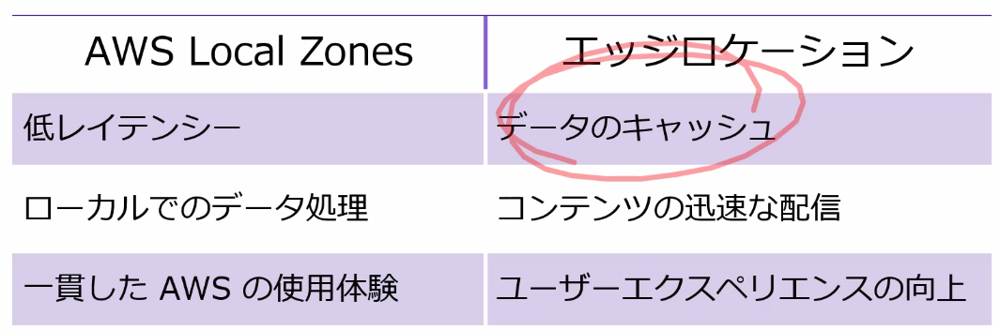</img>
  <br>

### Well-Architected フレームワーク

- ベストなクラウドアーキテクチャを作るための方法や、評価基準を提供するフレームワーク
- セキュリティ：全てのリソースに対して、最小権限を必要な人に付与できていること
- パフォーマンス：やりたいことを実現するために最大効率を生み出せるサービスを選定、利用できていること
- 持続可能性： 環境に配慮して長期間持続可能なシステムになっていること
  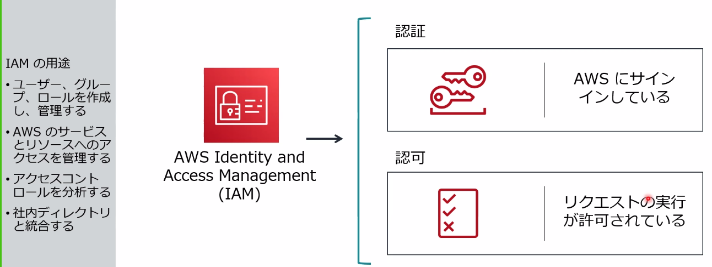</img>
  <br>

### 学び

- AWS は 1994 年にジェフベソス社長がオンライン書籍販売をするシステムを開発していたが、ビジネス規模拡大に対して、システムのスケーリングが追いつかなかった。
  - だから、数万台規模の Linux ベースの巨大な仮想化インフラを作った。
  - その後に API ベースで Linux サーバーの立ち上げなどの命令を出せるように作った
  - 次にドメインビジネスに紐づくシステムを、各データ出力用の API に分けて部品化した
- サーバーレスの学び
  - サーバーレスは`VPCインフラストラクチャ内で実行されない`
  - VPC ベースのリソース（Ex.VPC 内の EC2）からサーバーレスサービスを呼び出すことができる
  - エンドポイント URL を用いてサービスにアクセスすることができる
- 試験では、`各リソースの対象外レベル（データセンター冗長やリージョン冗長）を問われる問題が多い`
- 【大事】リージョンの選定方法
  1. 自社のガバナンスで許容されている国に属するリージョンか
  2. レイテンシーが自社システムで許容可能な範囲内か
  3. 特殊なサービスがリージョンに対応しているか（人工衛星のサービスは特定リージョンのみ利用可能）
  4. リージョン利用コストが許容できるか（US が安い、日本は真ん中くらい）
- 【大事】試験では、やりたいことを全て実現可能な選択肢の中から、`Well-Architectedに準拠した設計`の選択肢を選ぶ試験になっていることが多い

## 2.アカウントセキュリティ

### テーマ

- アカウント管理のベストプラクティス

### IAM

- IAM はアカウントを`利用して良いかどうかを認証`し、`アカウントは何をやってよいか`を管理する
- プリンシパル：IAM を使ってリソースを操作できる人、アカウント
  </img>
  <br>
  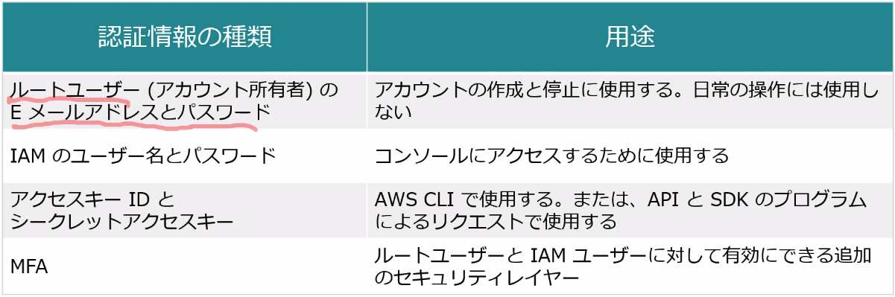</img>
  <br>

### AWS アカウントのルートユーザ

- AWS の全てのサービスにフルアクセス権限がある
- 権限が強すぎるので日常の操作でルートアカウントを使ってはいけない
  - サインアップして、作業用の IAM ユーザを作ったら封印する

### IAM アカウント

- ユーザ、グループ、ロールを作成して管理できる箱
- アクセスコントロールを分析できる
- `社内ディレクトリと統合`して、既存のアカウント情報にロールを付与できる

### プリンシパル

- AWS リソースへのアクセスや操作ができる権限を持つエンティティの総称
- ユーザや AWS サービス（Ex.EC2）、ID プロバイダーなど

### IAM ユーザ

- AWS アカウント内に作られるユーザ
- ユーザごとに独自の認証情報（ID/PW,二要素認証,SSO など）
- ユーザをグルーピング( =IAM ユーザグループ )して、`その業務に必要な最小権限を付与する`のがベストプラクティス
- 【重要】時間ごとに利用する複数権限を切り替えたい場合は、IAM ロールを利用する。そうすることで`ユーザ自身で同じIAMユーザのまま必要なロール（ = 認可情報 ）に切り替えることができる( =スイッチロール )`
  - 切り替えられたロールの制限時間は、`デフォルトで1時間`。終わったら元の認証情報に戻る
  - 権限は上書き変更、切り替え前のロールを切り替え後のロールで使うことができない

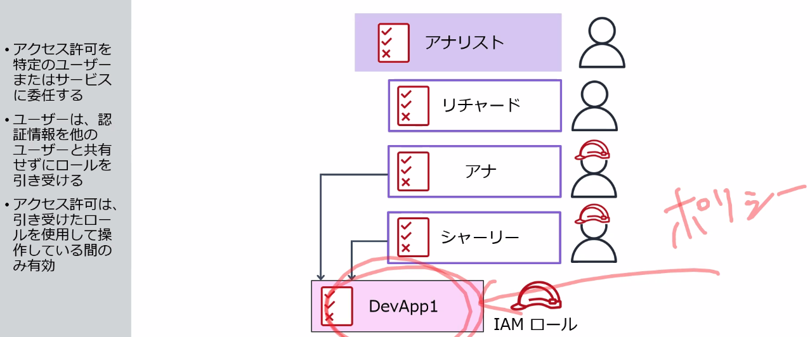</img>
<br>

### ロールを引き受ける

- ロールに記載されている`ポリシーを使うことができる状態に遷移する`こと
  1. 信頼されたプリンシパルから`AWS STS`に対して API コールをしようしてロールを引き受ける
  2. AWS STS がそのコールを受理したら`一時的なアクセスキーとシークレット`を渡す
  3. 一時的なアクセスキーとシークレットを用いてリソースを操作する

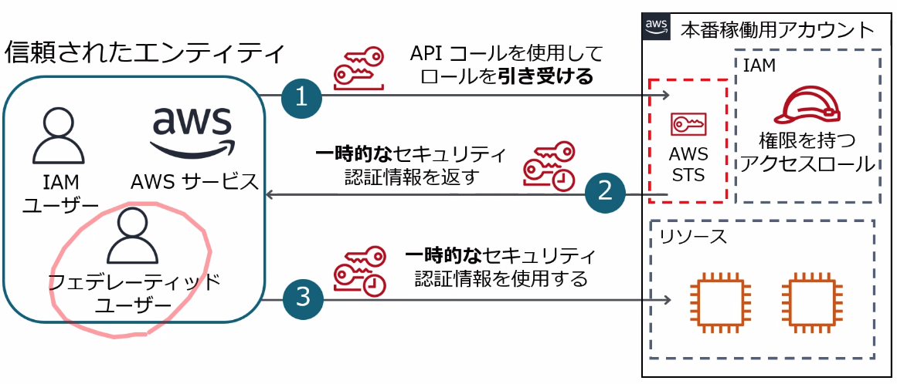</img>
<br>
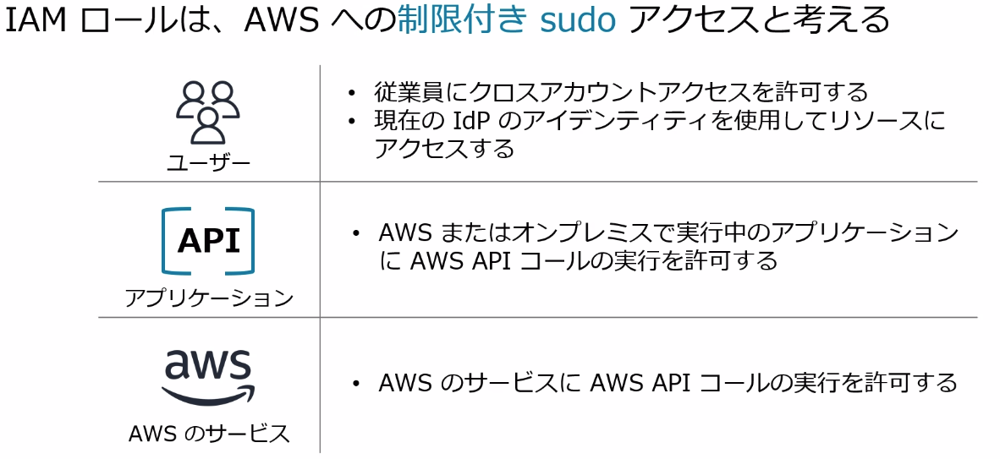</img>
<br>

### ポリシーの種類

- アイデンティティベースポリシー
  - ユーザがしてもいいことを定義する
- リソースベースポリシー
  - リソースがされてもいいことを定義する
  - 誰かがリソースにアクセスしようとした時にチェックされる
  - そのリソースのみに付与されるインラインポリシー
- 【大事】各アクションは`暗黙的に拒否`される。つまり書いてないことはできない。
  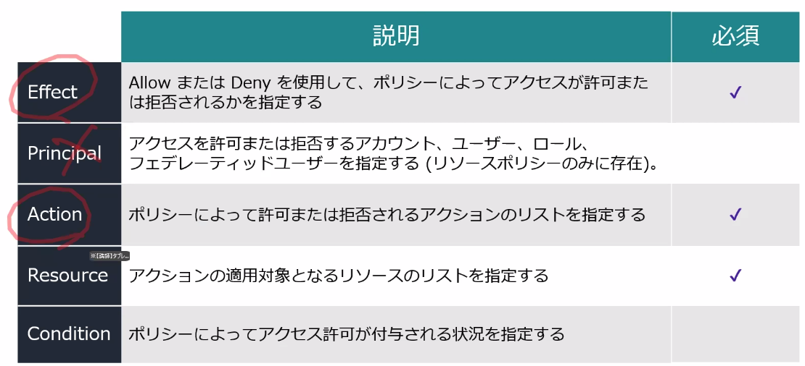</img>
  <br>

- 【サブ】アクセスアドバイザー
  - ユーザーが最近利用した IAM ポリシーの利用履歴を見ることができる
  - IAM ポリシーの最適化に役立つ  
    <br>
- 【サブ】アクセスアナライザー
  - 外部リソースからアクセスがあったリソースのアクセス履歴を見ることができる

### IAM ポリシーの特性

- Condition 要素はオプション要素で、有効になるタイミングの条件を設定できる
  - Ex.指定した Tag 名の場合はアクセス許可を付与する
- ポリシーの優先順位は 明示的な拒否 > 明示的な許可 > 暗黙的な拒否

### 【大事】多層防御

- ユーザが`してもいいこと`、リソースが`されてもいいこと`の二つのポリシーを定義することで、全てが許可されているアクションのみ実行できるような制御フレームワーク
- 多層防御は以下ポリシーによって制御する
  1. SCP（Service Controll Policy）
  2. IAM アクセス許可の境界
  3. IAM ポリシー
     _ アイデンティティベースポリシー
     _ リソースベースポリシー
     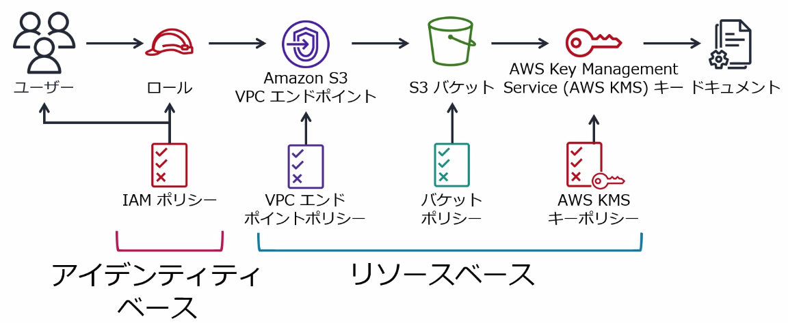</img>
     <br>

### 【大事】IAM アクセス許可の境界

- ユーザアクセス許可が付与されているが、ガバナンスとして`ここだけは拒否したい権限の上限`を制限したい

### 【大事】アカウントフェデレーション(Identity Center)

- 外部サービスや AWS アカウントに対する認証情報、認可情報を管理することができる

### 複数の AWS アカウントを使用する理由

- 色々な理由がある
  - チームごとに分ける
  - セキュリティとコンプライアンスの管理
  - 請求アカウントごとに分ける
  - リスクを分離する
  - ビジネスプロセスごとに分ける
- マルチアカウントには弊害が発生する
  - ポリシーをアカウントごとに福瀬牛なければならない

### AWS Organizations

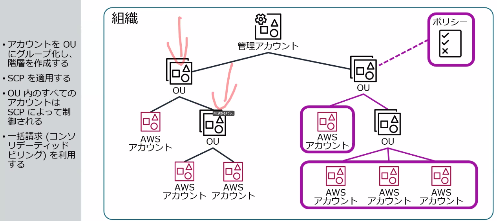</img>
<br>

- AWS アカウントを OU にグループ化して階層を作成する
- OU に対して、`管理アカウントで定義した共通ポリシーをOUに割り当てる`ことができる
- 一括請求機能を用いて請求金額の合計を管理アカウント宛に請求することができる
- 【大事】ボリュームディスカウントを活用できる
  - 全 AWS アカウントの利用料金が合算されるため、割引率が高くなる

### CSP （サービスコントロールポリシー）

- IAM アクセス許可と SCP の共通部分にあるもののみを許可する
- デフォルトで全て許可になっている
- AWS Organizations で作成している OU に`共通処理（多額の請求が発生するサービスの購入など）`を制御できる

### AWS Control Tower

- マルチアカウント構成に対してベストプラクティス（ランディング）の構成を CloudFormation を使って自動生成してくれる

### 学び

- sssss
- sss

## 3.ネットワーク 1

### VPC(Amazon Virtual Private Cloud)

- ワークロードの論理的分離を提供
- 【大事】単一の AWS リージョンに結びつけられる(`リージョンを跨げない`)
- VPN に対してアベイラビリティゾーンを定義できる
  - アベイラビリティゾーンに対して複数のサブネットを作ることができる
- サブネットは VPC で定義している CIDR 内の IP レンジで作成できる

### パブリックサブネットとプライベートサブネット

- 【大事】サブネットはそれぞれ 1 つのアベイラビリティゾーンに作ることができる（`ゾーンを跨げない`）
- サブネットごとに以下`IPアドレス5つ`は予約されている
  - 1 番目：NW アドレス
  - 2 番目：GW アドレス
  - 3 番目：DNS アドレス
  - 4 番目：予約アドレス
  - 最後：ブロードキャストアドレス
- プライベートサブネット内の IP アドレスはインスタンス再起動しても同じ IP アドレスが割り当てられる \* プライベートサブネットにグローバル IP アドレスを割り当てても`インターネットゲートウェイがないから外部宛に通信ができない`
  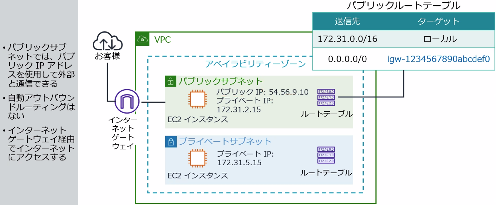</img>
  <br>

### 【要復習】インターネットゲートウェイ

- インバウンドトラフィックは基本的に全許可される
- IPv4 アドレスが割り当てられているインスタンスへ NAT をする
- `Static NAT(プライベートIPとグローバルIPが一対一で割り当てられる)`で動作する

### ルートテーブル

- VPC には暗黙的なルーターが存在している
- ルートてテーブルを使用してネットワークのトラフィックの送信先を制御する
  - ルートテーブルの割り当て先はサブネットになる（これをパブリックサブネットと呼ぶ）
- 【大事】インバウンド設定は自動的に全許可される
- ルートテーブルのネクストホップは`ターゲット`と呼ぶ
- プライベート IP アドレスが定義されているルートテーブルが存在している場合は、プライベートサブネットと呼ぶ

### Elastic IP アドレス（固定 IP アドレス）

- こんな時に再起動ごとにグローバル IP アドレスが変わるのはめんどくさい
  - DNS の名前解決を設定している場合
  - 外部サービスの送信元 IP アドレスを固定している場合
    - `このケースでElastic IPを使うのは悪手`
- リージョンごとに 5 個まで Elastic IP アドレスを使うことができる
- Bring Your Own IP をサポートしている
- 【大事】Elastic IP は`使っていなくても確保するだけで課金される`

### ENI(Elastic network interface)

- 仮想 NIC
  - 同じ AZ 内のリソース間で移動できる
  - プライベート IP アドレス、ElasticIP アドレス、MAC アドレスを維持できる
- こういう時に使える
  - ザビックス監視などの管理用 IP アドレスを別で用意したい場合
  - 二つのサブネットをまたがって IP アドレスを設定して、ルータのような使い方をしたい場合
    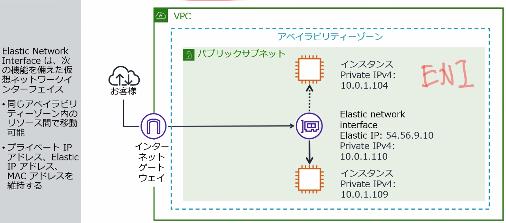</img>
    <br>

### 【要復習】NAT

- プライベートサブネット内のインスタンスからインターネットまたは AWS の他のサービスに会うとバウンド通信をできる
- インターネットのセキュリティパッチを撮りに行きたい時
- 外部のパブリックなサービスにアクセスしたい時
- 【大事】NAT ゲートウェイは AZ に対して作られる
  - つまり、`ゾーン障害が発生した時は停止するリスク`がある
  - リージョンで冗長化したい時は、各 AZ に NAT を作る必要がある
  - どうやってプライベートサブネット内の EC2 は複数の NAT GW をターゲットに設定できる？
- `IPv6に対応していない` → Egress-Only IGW を使う

### 【要復習】Egress-Only 　インターネットゲートウェイ

- IPv6 のインスタンスを使用して外部宛通信のみ許可したい時はこのサービスを使う

### 【大事】VPC の多層防御

- ルートテーブル：必要のないトラフィックを落とす
- ネットワーク ACL：？
- セキュリティグループ：対象サーバーが受け付けられるポリシーのみ許可する
  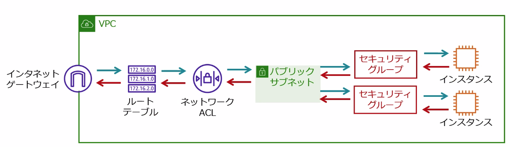</img>
  <br>

### ネットワーク ACL

- ネットワークレイヤーのファイアウォールとして機能する
- VPC に対して設定して、サブネットに割り当てる
- アウトバウンド、インバウンドはデフォルトで全て許可
  - ルール追加時は番号が若い順に優先的に処理される
  - 最下部のルールに全拒否を入れるのが良さそう

### セキュリティグループ

- ENI 単位で制御するネットワークフィルタリング。NSG 的なやつ
- インバウンドルールがなく、アウトバウンドのみルールを作れる

### 【大事】セキュリティグループのチェーン

- セキュリティグループの送信元に、`セキュリティグループを指定することができる`
  - セキュリティグループ内の IP アドレスの変更に強くなり、ベストプラクティスとなる

### 学び

- sssss
  - sss

## 4.コンピューティング

### AMI(Amazon Machine Image)

- インスタンスボリュームのテンプレート、OS 情報、起動許可設定をイメージ化したもの
  - 同じものを何度も作りたい、AMI に機能を追加してデプロイしたい
  - 再現性、再利用性、回復可能性といったメリットがある
- AMI の取得方法は、Amazon が提供しているイメージ、AWS Marketplace や自分で作るがある
- 【大事】アプリケーションが`メモリを多く使うか、CPUを多く使うか`で使うマシンタイプを判断する

### インスタンスタイプ

</img>
<br>

### EC2 インスタンスのライフサイクル

- ストレージはシャットダウンしても確保されてお金がかかる
  - お金をかけたくない場合、インスタンスを終了して、ストレージも削除する
- 停止中は EBS-Backed インスタンスに確保されているため課金が発生する
  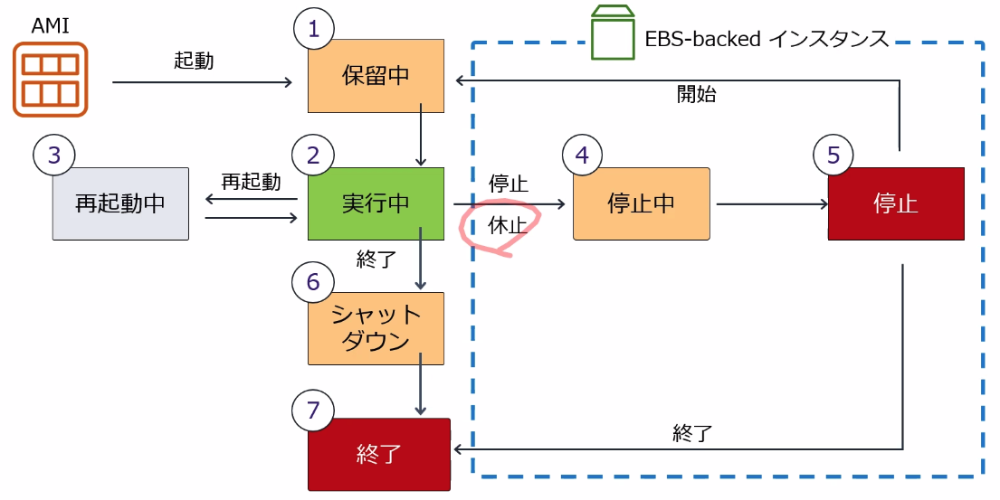</img>
  <br>

### 【大事】インスタンスメタデータ

- instance-id: `デプロイ後`に一意に定まる ID
- public-hostname: インスタンスオブジェクト生成時に一意に定まる ID
  - インスタンス生成前に一意なデータを利用したい場合はこれを使う
- 他にも IP アドレス情報とかがある
- 【大事】

### EC2 のキーペア

- AWS 側で発行されるプライベートキーを用いて EC2 にアクセスする
  - EC2 側で受け取ったプライベートキーと AWS のパブリックキーで検証して通ったら SSH を通す

### EC2 の購入オプション

- オンデマンドインスタンス

  - 秒単位、時間単位で生産
  - 検証などで一時的に使いたい時におすすめ

- 標準リザーブドインスタンス

  - 年単位で一括料金を払うと割引が受けられる
  - 全額前払い、半額前払い、分割払いが選べる

- コンバーティブルリザーブドインスタンス

  - 標準で足りなくなった場合`増強に限り`インスタンスのサイズ変更ができる
  - 標準と比べて割引率が低くなる

- スポットインスタンス
  - アベイラビリティゾーンに余剰がある場合に、使える割引率の高いインスタンス
  - 割引率が非常に高い代わりに、AZ が逼迫したら 2min の通知と共に削除される
    - そのため、インスタンスをステートレスにすることで、`EC2の復旧を早くする設計にする`のが大事
  - 普段は使わないが、一時的に高性能の CPU を利用したい場合にも使える

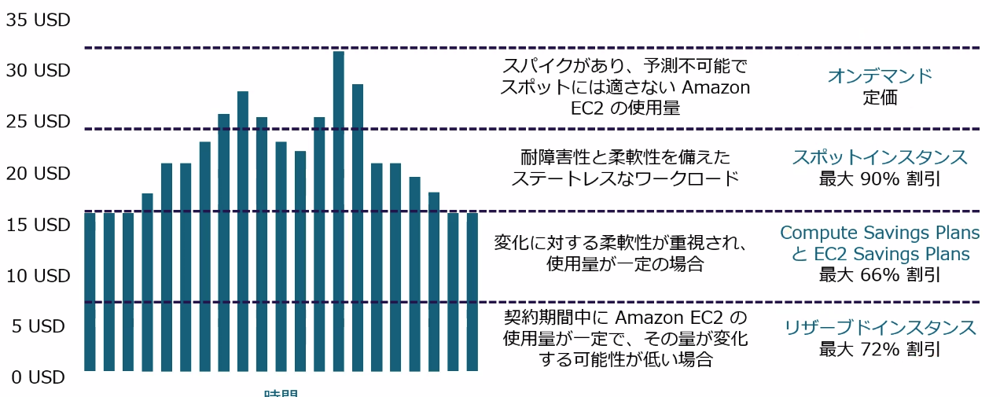</img>
<br>

### Amazon EBS(Electric Block Store)

- EC2 のボリューム(=起動ディスク)を補完する領域
- 【大事】`アベイラビリティゾーン内`で定義される
- デフォルトの場合、EC2 を終了する時に一緒に削除される
- スナップショットは`差分更新で補完され`復旧の際は差分を集約してバックアップを作る
- データは S3 に書き出される
- スループットを大きくしたい場合は IOPS SSD を使う
  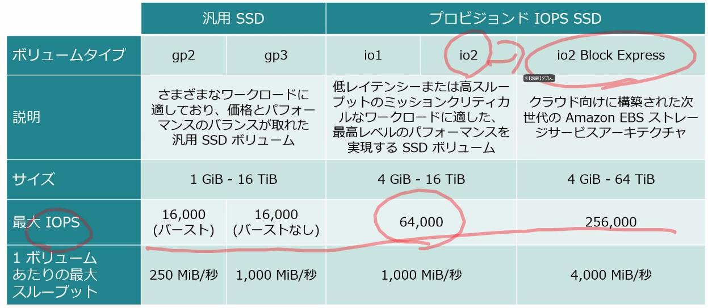</img>
  <br>

### HPC(High Performance computing)

- 気象予測や遺伝子分析などのハイスペックな CPU を使える特別なインスタンス
- ネットワークオプションとして、非常に早い通信回線を構築できるが`単一サブネットでしかルーティングができない`。つまり同一 AZ 環境ないで作る必要がある

### クラスタープレイスメントグループ

- 同じアベイラビリティゾーンに EC2 インスタンスを集約することができる
  - レイテンシーを極限まで抑えることができる代わりに、可用性が下がる

### スプレッドプレイスメントグループ

- 少数の重要なインスタンスを分離して保持することができる
  - 可用性を高められる代わりに、通信速度が落ちる

### パーティションプレイスメントグループ

- クラスタープレイスメントグループを複数のリージョンに複製して配置する
- クラスターとスプレッドのいいとこ取りができる
  - HDFS のような分散コンピューティングを実装するときなどに使える
    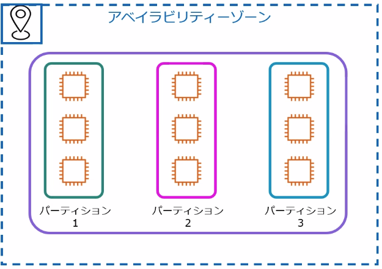</img>
    <br>

### Lambda

- AWS のサーバーレスコンピューティング
- Nodejs,Java,Python などの主要言語をサポートしている
- 最大実行可能時間は`15分`まで
  - 【大事】長時間のワークロードを実行したい場合は処理を`複数のロジックに分割して複数のLambdaでワークロードを実行する`のがベストプラクティス
- 最大メモリ上限は`10GBまで`サポートしている
- 東京リージョンの場合は最大 1000 台まで自動スケールされる
- 【大事】イベントが発生した時だけ簡単な作業を行うようなワークロードで活躍する
  - 大規模バッチなどの長時間稼働の場合は EC2 を採用する
- イベントソースは AWS のイベントがサポートされている
  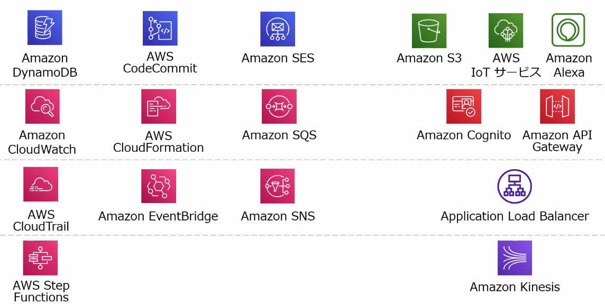</img>
  <br>

## 5.ストレージ

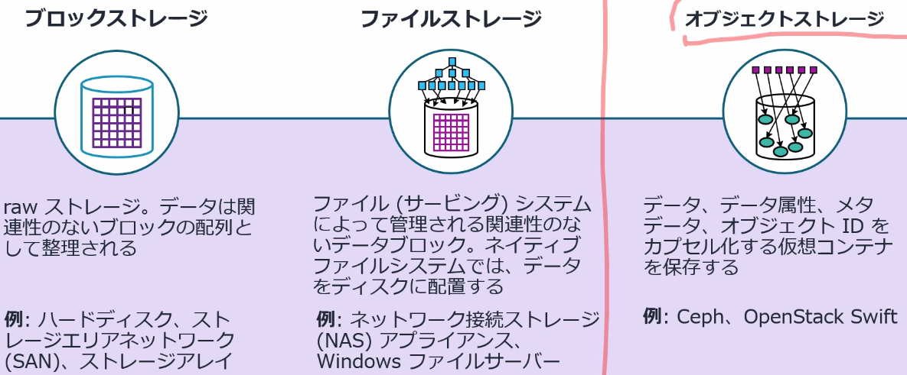</img>
<br>

- オブジェクトストレージは、`格納後のデータ編集はできないが、①無制限に保存ができる、②HTTPベースでのアクセスができる`

- ストレージの全体像
  - ブロックストレージ：EBS
  - ファイルストレージ：AmazonEFS, AmazonFSx
  - オブジェクトストレージ：AmazonS3,AmazonS3 Glacier

### S3

- S3 はデータがオブジェクトとしてバケットに保存される
- バケットはオブジェクトを保存する箱。URL を用いてアクセスする
  - バケット名はグローバルで一意に定める必要がある
- オブジェクトは、プレフィックス＋ファイル名で`オブジェクトキー`として定まる
- 同じバケット、オブジェクトキーに保存した場合は、`上書き更新`される
  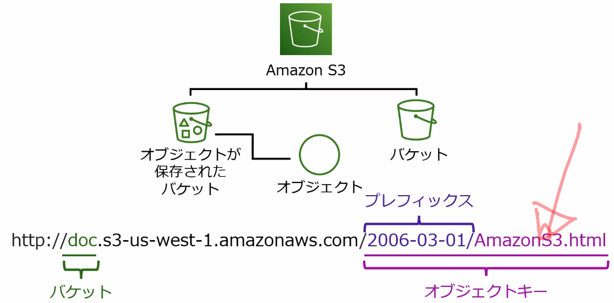</img>
  <br>
- アクセス制御には、デフォルト、パブリック、アクセスポリシー（リソースベース IAM ポリシー）の三種類がある

### S3 のブロックパブリックアクセス

- バケットをパブリックに公開したい場合は、リソースベースポリシーでアクセス許可するだけでなく、`ブロックパブリックアクセス`をオフにする必要がある。
  - これは`不用意な公開を防ぐための安全装置`

### 【大事】S3 のバージョニング

- 一つのオブジェクトに対して複数のバージョンを同じバケットに保持する
- バージョニングが有効なバケットは`Version ID`によって管理される
  - 上書き保存を繰り返して知らない間に料金が肥大化させることを防ぐために`デフォルトでオフ`になっている

### 【大事】ストレージクラス

- S3 の課金体系
  - 保存容量
  - アクセス回数
  - 【サブ】通信容量
- 以下操作には課金されない

  - S3 へのアップロード
  - 同じリージョンの EC2 へのデータ転送
  - CloudFront へのキャッシュ
    - Cloud Front にデータを送ることで、S3 へのリクエスト数を削減することができる

- 各クラスは`アクセス頻度と容量`に応じて最適なクラスを選定できる
  - S3 標準：日々アクセスされるデータはここに保管、ミリビョウ単位の早いアクセス
  - S3 IA：あまり頻繁にアクセスされないデータ、容量単価が安く、読み書きにかかる費用が高い
    - サポートしている容量は 128KB 以上
  - S3 Intelligent-Tiering：アクセスパターンの変化に応じて S3 と S3-IA への切り替えを行ってくれる
    - ただし 128KB 以上のデータのみ切り替えを行ってくれる
    - さらに 60 日間アクセスがない場合は、Glacier Instant Retrieval に保存する
  - S3 Glacier：一年に数回しか使わないデータを圧縮することで安く補完できる
    - S3 Glacier Flexible Retrieval：1min~12h の時間をかけて取り出す方式
    - S3 Glacier Deep Archive：取り出しに一番かかるが S3 の中で一番安い
    - データの最低保持期間が`90日`
      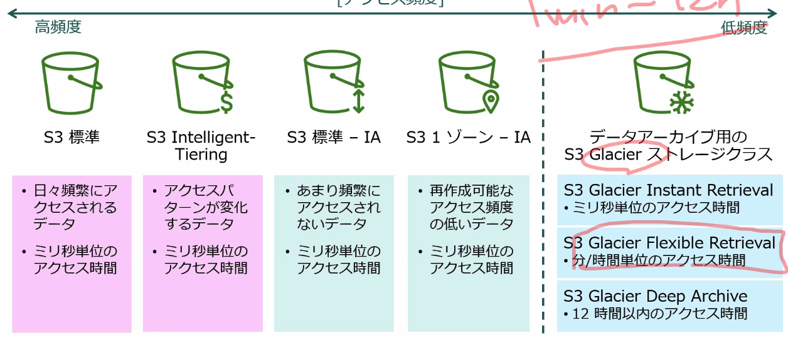</img>
      <br>

### S3 Glacier

- S3 とは独立したサービスとして提供している
- 独自のボールドロックというアーカイブ方式を使っている
  - ボールドロックは解凍できる権限を`IAMポリシーに設定することでデータアクセスを制御`できる

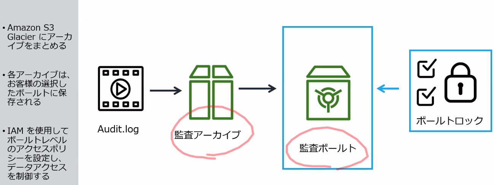</img>
<br>

### S3 のライフサイクルポリシー

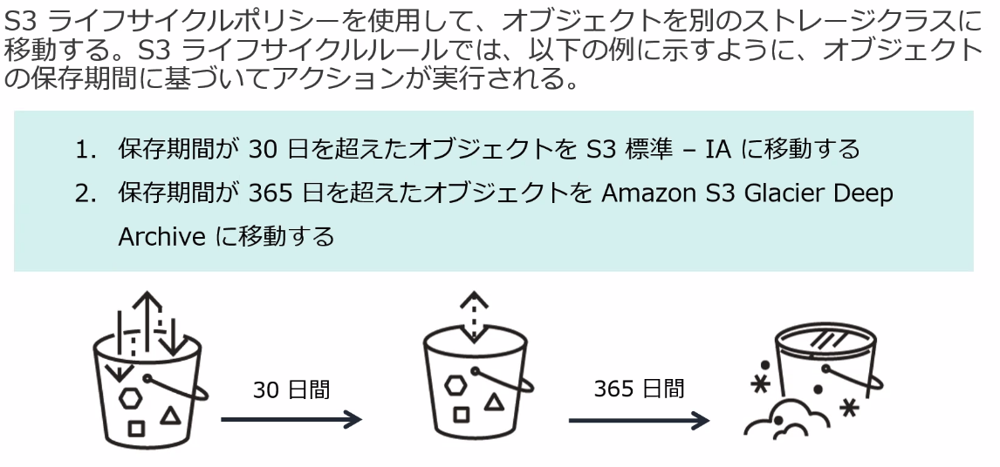</img>
<br>

### S3 の保管時の暗号化

- S3 バケットは SSE-S3 という暗号鍵で暗号化することができる

### 【大事】S3 のイベント通知

- S3 バケットにオブジェクトが作成されたことをイベント通知して Lambad に命令を実行することができる

### マルチパートアップロード

- 大容量のデータを S3 にアップロードする時は、細かいデータに分割してアップロードすることができる
  - 帯域に制約があってもアップロードすることができる
  - 分割したデータの一部が失敗したとしても、その一部のみをリトライさせることができる

### AccessPoints ソリューション

- バケットポリシーは、バケットを利用する部署が増えるたびにポリシーが肥大化してしまう
  - AccessPoints ポリシーを定義することで、オブジェクトに個別にポリシーを付与することができる

### ObjectLambda

- S3 に入れるバケット、取り出すバケットを xml や json など必要なデータ形式に変換することができる
  - これにより Lambda でのデータ取り扱いに必要な変換処理を作り込み必要がなくなる

### 【大事】S3 のベストプラクティス

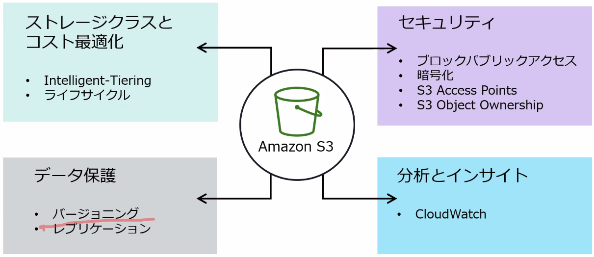</img>
<br>

### Amazon FSx

- Windows で使いたい場合は Amazon FSx for Windows File Server を利用する
- 超高速で大容量データを扱いたい場合は、Amazon FSx for Lustre を利用する

### Amazon FSx for Windows File Server

- SMB 3 をサポートしている
- AWS Managed Microsoft AD との連携が必要

### 【参考】AWS のデータ以降ツール

- 物理データ移行
  - AWS Snowcone
    - 小型で頑丈なエッジコンピューティングおよびストレージ
  - AWS Snowball Edge
    - 旅行鞄くらいのストレージ、1 台 80TB でペタバイト単位のデータ転送をサポートする
  - AWS Snow Mobile
    - トラック。1 台あたり 100PB で、数台でエクサバイト単位のデータ転送をサポートする
- オンラインのデータ移行
  - DataSync
    - オンプレミスのファイルシステムに DataSync エージェントを入れて、エージェント経由でデータを転送する
  - Storage Gateway
  - ファイルゲートウェイという`サーバーをマウントして`、HTTPS 通信を用いて Strage Gatway サービスにデータを転送して、それを S3 バケットに格納する
  - ファイルゲートウェイをオンプレのファイルサーバーにマウントして、ドライブと同じような使い方でデータを保存できる

## 6.データベースサービス

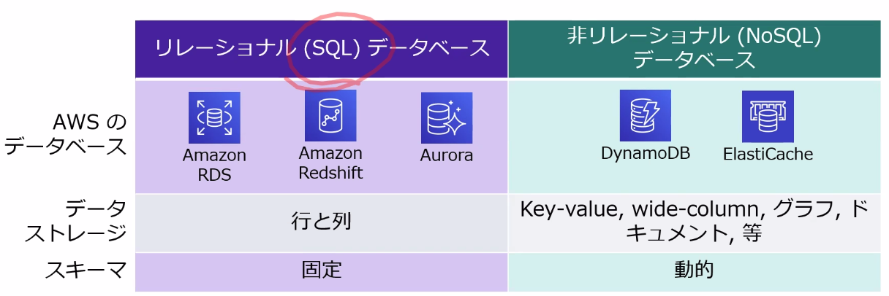</img>
<br>

### データベースの使い分け

- 負荷が変動的だったり、新機能が頻繁に加えられて取り扱うデータが変わる場合は NoSQL を利用する
  - 逆に決済サービスなどの、データ管理を厳密に扱ったり、スキーマが不変的なシステムを取り扱う時に利用する
  - NoSQL はスケーラビリティを重視しているため、分散されてデータを管理されている。そのため、アクセスタイミングとアクセスするサーバーによっては返すデータが変わることがある（`結果整合性`）

### Amazon RDS

- ほとんどの SQL と互換性のあるサーバーレス SQL サービス
- 接続先エンドポイントは IP アドレスではなく`ドメイン名`で指定することができる
  - 障害で IP アドレスが変わるなどの障害に強くなる
    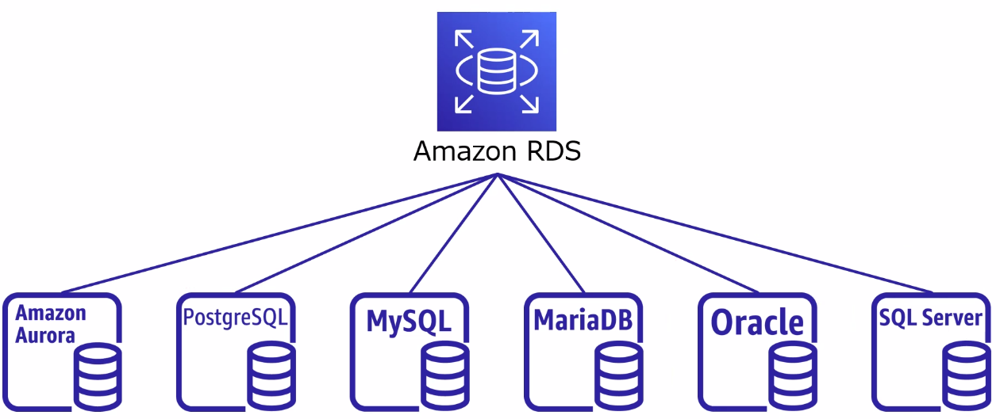</img>
    <br>
- マルチ AZ フェールオーバーイベント
  - スタンバイは、プライマリとはことなる AZ に配置されている
    - 障害が起きてもスタンバイが、プライマリのドメイン名に割当たるため、利用者は意識しなくてもプライマリの DB をアクセスし続けられる
  - この仕組みは、正常稼働系が常に用意されているため、フェールバックという概念がなくなる

<br>

- リードレプリカ
  - 読み取りの多いワークロードの場合は、読み込み専用のレプリカを用意することで、プライマリ DB へのアクセス頻度を抑えてシステム全体のスループットを向上させることができる
  - 注意点として非同期レプリケーションとなっているため、`同期タイミングは保証されない`
    - なので、リアルタイムのデータを求められないワークロードで使える

<br>

- 暗号化
  - 暗号化はデータキーで暗号化されて、そのキーをさらに KMS で暗号化して保村される

### Aurora

- クラウド向けに構築された、MySQL および PostgreSQL と互換性のある RDS
- Aurora DB クラスター

  - 3 つの AZ にコピーを 2 つ保管している
  - Aurora のプライマリインスタンスが落ちても 10 分で復旧することができる
  - クラスターが 10GB 単位で自動で水平スケーリングされるため、容量の増強と`縮小`を意識することなく実施できる
    - Amazon RDS は増強ができるが縮小ができない
  - スタンバイ機はレプリカとして稼働していて、プライマリが障害になると`自動で`プライマリに昇格する
  - ただし完全な互換性があるわけでもないため、条件によっては Amazon RDS を選定する必要もある
    - 新規構築時には積極的に Aurora を使う

- Aurora Serverless
  - オンデマンドで起動して使用時以外はシャットダウンする完全停止ができる
  - スケーリング時のアプリケーションへの影響もない

### DynamoDB

- カラム思考の NoSQL データベース
- オンデマンドにすれば数万のアクセスにも一瞬で対応できるスケーラビリティを持つ
- ユースケース
  - ショッピングカート
    - 大量の商品購入リクエストがあっても自動でスケーリングできるので相性がいい
- DynamoDB の整合性オプション
  - DynamoDB は 3 つの AZ にバックアップを保存している
  - 結果整合性
    - DynamoDB は 3 つ中 2 つにデータ更新ができると、アプリに更新済みの結果を応答する
    - 1 秒で全てのレプリカにデータを更新できるがその 1 秒の間は接続先によって結果がずれる
    - 強い整合性と比べて`半分の金額`で利用できる
  - 強い整合性
    - すべてのレプリカがデータを更新されるまで結果をもらいたくない場合はこの機能に紐づく API を使う
    - 全ての同期が済んだことを確認してからデータを応答するので、応答までに時間がかかる
- グローバルテーブル
  - リージョン間でのレプリケーションを自動で行ってくれる

### キャッシュ戦略

- 遅延読み込み
  - データリクエストしてキャッシュがあればキャッシュからデータを返し、なければデータベースから返す
    - デメリットとして、キャッシュが DB のデータ変更に気づかず、古いデータを保持し続けるリスクがある
  - 対応策としてキャッシュに`TTL（有効期限）`を設定することができる
- 書き込みスルー（＝ライトスルー）

  - データを書き込む時にキャッシュも書き込む
    - 書き込むたびにキャッシュに保存するのでキャッシュが肥大化してしまう

- ElastiCache

  - memChached と互換性のあるキャッシュ

- DynamoDB Accelerator
  - リアルタイム広告などの DynamoDB のスループットでは間に合わないようなこうスループットを求められるワークロードに使われる高可用性キャッシュ

### データベース移行

- AWS DMS

  - オンプレミスの DB から、AWS DMS（EC2 で動くサービス）宛に、インターネット経由でデータ送信することができる

- AWS Schema Conversion Tool
  - ストアドプロシージャなどの DB に関連するデータソースも送ることができる

## 7.モニタリングとスケーリング

### CloudTrail と

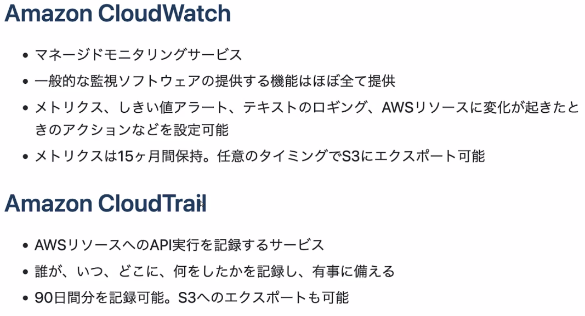</img>
<br>

### CloudWatch Events と Eventbridge

- Eventbridge が後継モデル
  - AWS のイベントだけでなく、外部サービスなどから API ベースを受け取って、後続のアクションを起こすことができる
    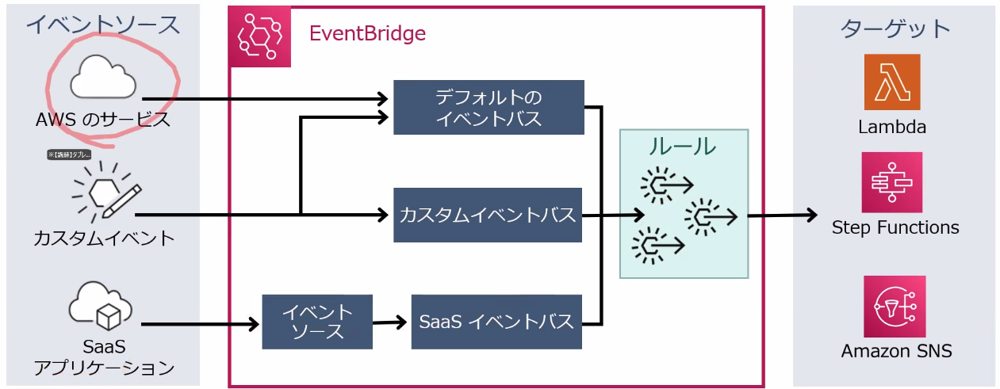</img>
    <br>

### ロードバランサーのコンポーネント

- ユーザがリスナーにアクセスした時に、ELB は登録されたターゲットに対して通信を割り振る
  - 設定時に`必ず複数のAZを設定必要`があり、設定するだけで高可用性を実現している
  - ユーザ ⇄ELB は SSL で終端して、後ろのターゲットとは平文で通信することで、ターゲットは暗号化処理が不要になる
- ロードバランサーは 4 種類に分かれる
  - ApplicationLoadBalancer
    - パスに応じてターゲットを選択することができる
  - TCP,UDP LoadBalancer
  - GatewayLoadBalancer
    - WAF などの接続先を IP でしか設定できないサービスの間に GLB を噛ませることで、複数台の WAF の接続点に GLB を中継することができる
  - ClassicLoadBalancer

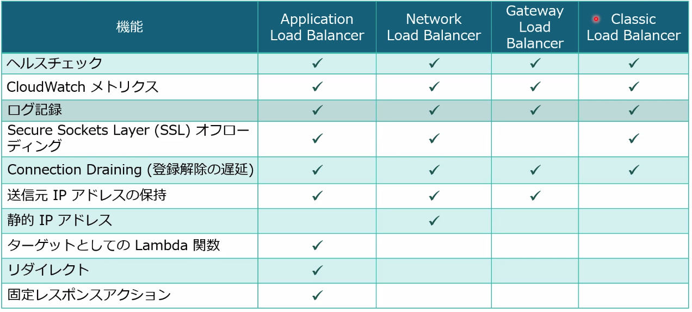</img>
<br>

- 【大事】ConnectionDraining は接続先ターゲットを外す時に、強制ログアウトを発生させないように、外してから 300 秒待機してから切断させる

## 8.オートメーション

### Infrastructure as code

- インフラの構成は設計書とパラメータシートのみで、デプロイ作業は手作業になるため、人によって時間がかかったり同じものを作れなくなる
  - 実行可能な手順書をテキストに落とし込むことで、誰が書いても同じ品質のインフラを構築できる
- スタック
  - 管理される AWS リソースのコレクションの単位
  - この単位でリソースの作成と削除を実行する
- テンプレート
  - スタックの集合体
- 変更セット
  - IaC に変更を加えた定義ファイルの差分を、変更適用前に表示してくれる機能

### SystemManager

- ```RunComannd

  ```

## 9.コンテナ

### Amazon Elastic Registry

- 自身で作ったコンテナイメージを保管する倉庫

### Amazon Elastic Container Service

- ECR に保管しているコンテナイメージを EC2 などのデプロイ先に配置する処理を実行するサービス
- 【大事】ECR オーケストレーション
  - 実行したい複数種類のコンテナイメージの個数を指定するだけで、`もっとも高可用性を実現できる配置`を決めて、各 AZ にデプロイしてくれる

### Kubernetes

- EKS
  - 運用が大変な k8s を手軽に構築、運用してくれる

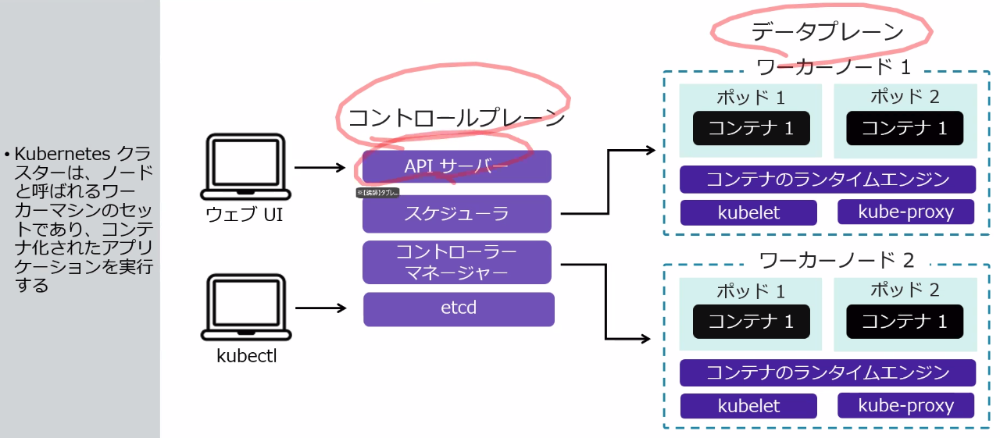</img>
<br>

### 【要復習】AWS Fargate

- たくさんのコンテナイメージ

## 10.ネットワーク 2

### VPC エンドポイント

- なんと、VPC エンドポイントを使わない場合は、プライベートサブネットから NAT ゲートウェイ → インターネットゲートウェイを介して DynamoDB にアクセスする
  - 外部接続用のゲートウェイを作る必要がある
- VPC エンドポイントを使うことで、外部接続用のゲートウェイを作らずに AWS サービスに通信できるようになる
  - ゲートウェイエンドポイントを作る時は ①VPC にゲートウェイエンドポイントをアタッチする ② ルートテーブルの接続先ターゲットにゲートウェイエンドポイントを設定する。
    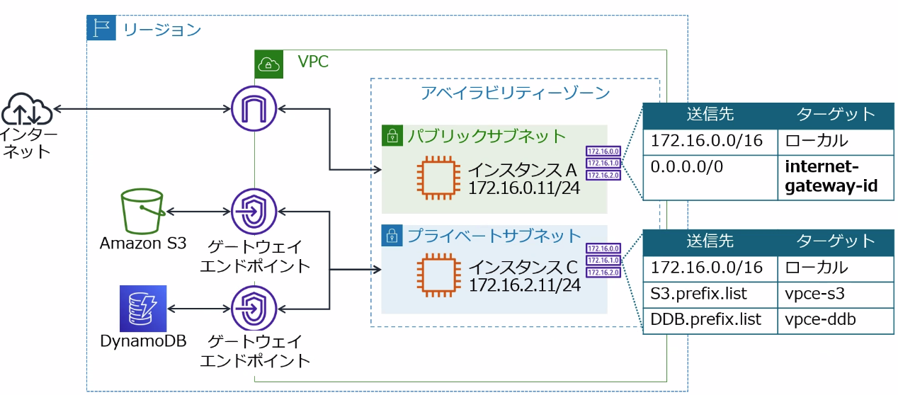</img>
    <br>

### PrivateLink ソリューション

- AWS 内部のリソース間通信を構築するアーキテクチャの総称を`PrivateLinkソリューション`と呼ぶ
- 例えば、オンプレミスから内部ネットワークのみで S3 にアクセスしたい場合は、オンプレミスから AWS のインターフェースエンドポイントを作成して、そこまでを`Direct ConnectまたはVPN接続`で繋ぐことで内部ネットワーク接続ができる
  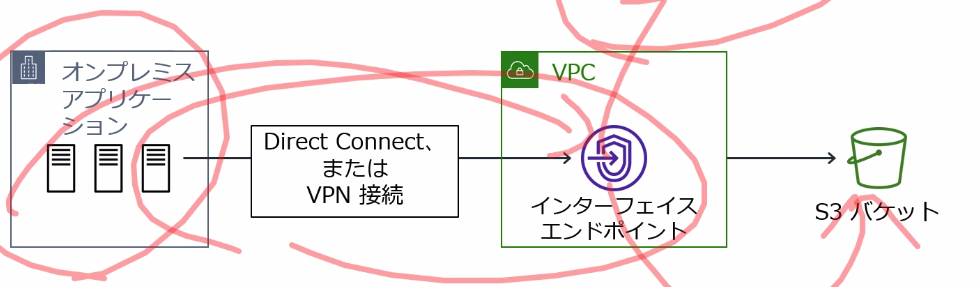</img>
  <br>

### VPC 間のピアリング

- VPC 間は VPC ピアリングを繋ぐことで、VPC 間でプライベート IP を用いて通信することができる
  - ただし、A->B->C に繋いでいる場合は A->C に直接通信ができない
    - その場合は A->C でピアリングを構成する必要がある
- 異なる AWS アカウントを跨いで接続することができる
  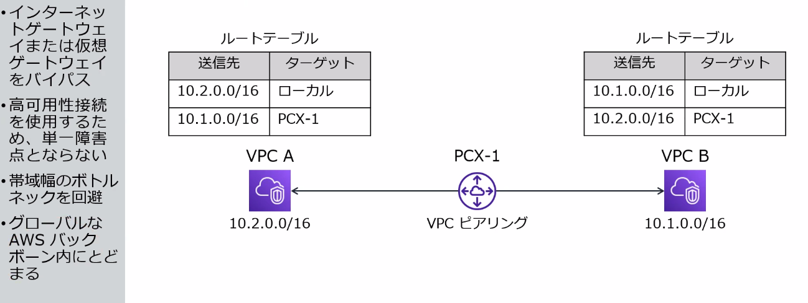</img>
  <br>

- TransitGateway
  - VPC が増えすぎて管理が煩雑になることを防ぐために作った、全てのピアリングを一つにまとめてくれるサービス
  - 設定値は`アタッチメント`、`オンプレ接続用のDirectconnect`、`TransitGatewayルートテーブル`
    - リージョンで TransitGateway を作って、ネットワークコンポーネントのターゲットをアタッチするだけ

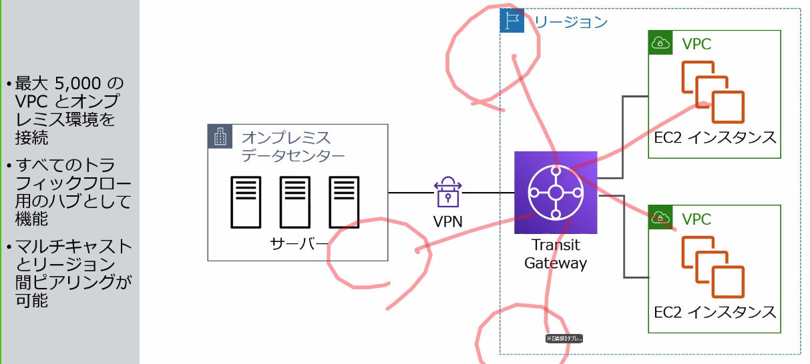</img>
<br>

### Direct Connect の設定

- AWS のプライベートネットワークとオンプレミスのネットワークを繋ぐ機能
- DirectConnect の接続方法
  - 単一リージョンとの接続
  - マルチリージョン/マルチ AWS アカウントとの接続
  - TransitGateway との接続

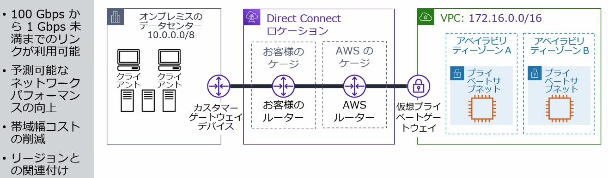</img>
<br>

### Route 53

- 地理的近接性ルーティング
  - あるリージョンのシステムに`地域と接続したいリージョン`を決めると、指定した地域は指定したリージョンのシステムにアクセスするように制御できる
- レイテンシールーティングポリシー
  - より応答が早い方のリージョンの IP アドレスを応答する
- 果汁ルーティング
  - アクセス回数に応じて、振るリージョンの割合を決めることができる

## 11.サーバーレス

### サーバーレスとは

- インフラストラクチャをプロビジョニング、管理する必要がない
- 必要に応じて自動でスケーリングされる
- CPU が処理している時間分の従量課金
- セキュリティと高可用性の機能を搭載している

### API Gateway

- アプリケーションのエントリポイントを作成する
- インターネットに後悔するか、内部利用に限定するか（認証、認可）を選択できる

### AmazonSQS

- 可視性タイムアウト
- SQS のユースケース
  - リクエストのオフロード
  - 時間がかかるような処理を SQS で非同期化する
  - オートスケーリング
    別のプロセスを追加して、メッセージのレートをアップさせる
- SQS キューのオプション
  - 標準タイプ
    - キューの順番を保証しない
    - API の API コール数はほぼ無制限
  - FIFO
    - 順番を保証する
    - API コール数は 1 インスタンスにつき 300/秒（MAX までスケールすると 3000 回/秒までいける）
- メッセージのライフサイクル
  - サブスクライバーが受け取ったメッセージを SQS が`一時的にロック`をして、他のサブスクライバーが同一メッセージを受信されないようにできる
- ロングポーリング
  - メッセージを見に行く都度で課金が発生する
    - 何回も見に行くとお金がかかりすぎる
  - ロングポーリングをすると、リクエストが返ってくるまで一定時間待機をして、まとめてメッセージを応答することができる
    - これによって受診する回数を減らして課金額を削減することができる
- メッセージキューの制約
  - 特定メッセージのフィルタリングができない
  - 大きなデータを取り扱うことができない（256KB まで）

### Amazon Simple Notification Service

- パブリッシャーが送ったトピックをいろいろなサブスクライバーにイベントとして発信することができる
  - E-mail,SQS,Lambda、CloudWatch のアラーム、アプリへの通知
- 特徴
  - 単一メッセージごとの配信
  - 配信後の取り消し不可
  - HTTP/S 　配信ポリシー
  - SNS は配信したら、
  - 標準トピック/FIFO トピック
  - メッセージの`永続性はない`
  - パッシブモード（プッシュ型送信）
- SNS から複数の SQS へ通知
  - メッセージの通知先が増えた場合は、SQS を一つ追加するだけで送信元のシステム改修を行うことなく、サービス関連携を拡張することができる。
  - 【大事】このキューを拡張することを`ファンアウト`と呼ぶ

### Kinesis

- BigQuery 的なやつ
- Kinesis Data Streans
  - インターネットや VPN にエンドポイントを作ることで、システムから大量データを送られてきた場合にそのリアルタイムデータを加工（マスキングや、DB 用の整形）を行って、後続の AWS リソースにおくることがきる
- Kinesis Data Firehose
  - リアルタイムに送らず、ある程度 KDF でバッファリングを持たせてまとめてデータを後続の AWS リソースに送ることができる

### Step Functions

- AWS のステートマシン（一定の動作状態を持って動作を変えるようなシステム）
  - ステートごとに呼び出す Lambda を制御することができる
    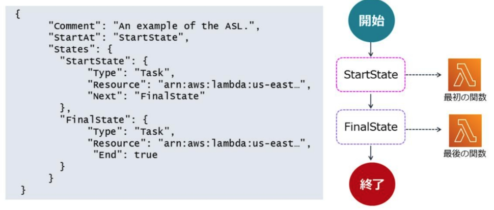</img>
    <br>

## 12.エッジサービス

- AWS エッジロケーション
  - DNS やセキュリティ製品など、世界各地に配置されているサービス
- AWS Local Zones
  - EC2 が配置されているシステムから遠い地域に属するユーザは、最寄りのエッジロケーションにキャッシュすることで、高速にコンテンツにアクセスすることができる（ただし、`静的コンテンツに限られる`）
  - CloudFront
  - CloudFront の設定手順
    1. オリジンを選択（S3 バケット、ELB、EC2 やオンプレミスサーバー）
    2. ディストリビューション（設定）を作成
    - パスパターン、プロトコルポリシー、署名付き URL、TTL など
    3. オプション
    - リクエストからイベントの生成、WAF のアタッチ
- AWS Outposts
- AWS Wavelength
