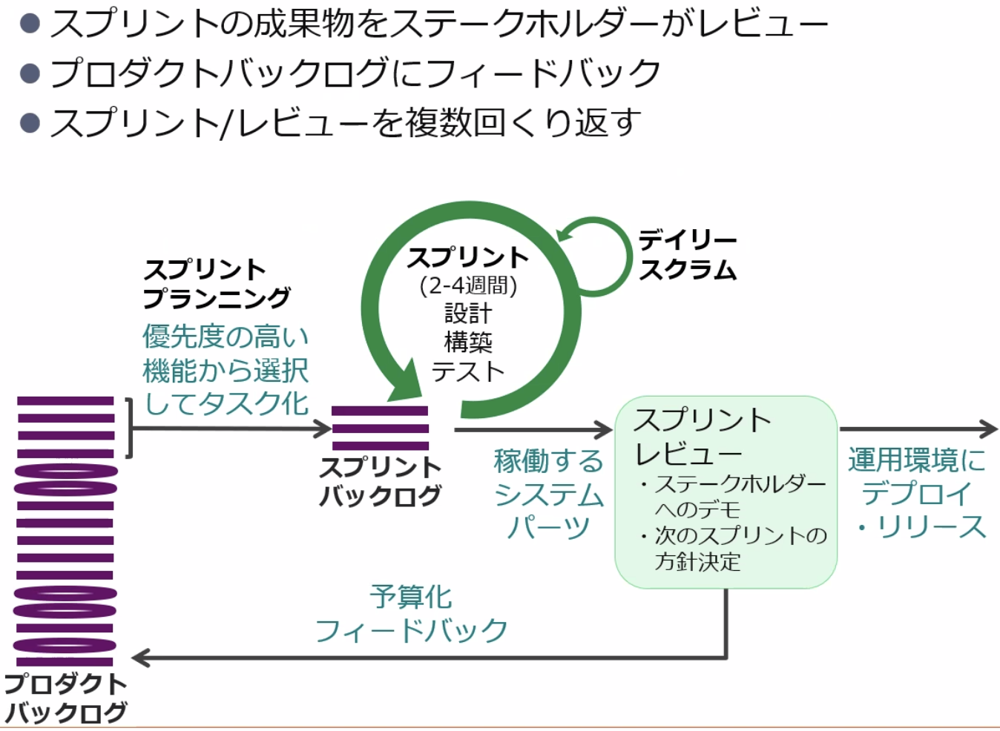
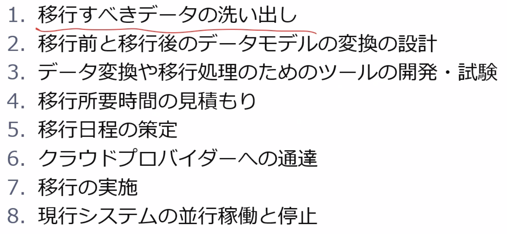

# レクチャーやラボで学んだことの備忘録

## 2.クラウド技術   
  ### 2-1.サーバー仮想化技術   
  * 物理サーバー内に仮想マシンを稼働させる技術
    * 代表製品：VMWare,Xen、HyperーV,KVM(GCPのComputeEngine)
    </img>
  ### 2-2.コンテナ技術
  *  どのOS上で実行しても同じアプリケーションを実行できる
  *  コンテナはVMより起動が早い   
    → コンテナはアプリケーションの実行のみで済むから
  </img>
  ### 2-3.ストレージ仮想化技術
  * SDS:  複数の物理ストレージを1つの巨大なストレージに見せる技術
  </img>
  * SDN:  ネットワーク制御用のコントロールプレーンを一元管理して複数のサーバーに一回の設定変更で反映させることができる
  * コントロールプレーンとデータプレーンが一つのネットワーク機器で提供されていた
  * 従来の課題は、ネットワーク機器ごとにコントロールプレーンを設定する必要があったため、効率が悪かった


  ### 2-4.CAP定理
  * 整合性は1970年台から重要視されていた（RDB型）
  </img>
  * BASE特性
    * ```可用性優先(Basically Available)```:サービス全体の停止を回避
    * ```柔軟な状態(Soft-State)```:たのコンピュータから状態情報を取得すれば回復可能
    * ```結果整合性(Eventual Consistency)```: 一時的なデータ矛盾を許容し、最終的には矛盾を解消  
  ### 2-5.リソース配信技術
  * CDNがなかったころは音声と映像に遅延が発生していた
  * DMMはダウンロードコンテンツにライセンス情報を付与して、日数の期限を設定して、視聴都度ライセンス認証していた
  </img>
  </img>


## 3.クラウド環境の全体像 
* テナント：各のカスタマーに個別のテナント環境
  * Azure:リソースグループ
  * GCP:ディレクトリ
* リージョン：地理的に離れた複数の箇所に物理インフラを集約
  同一リージョンでも50km以上離れてDC設置されている
* APIによる制御
  APIに対して緊急な修正が必要になった場合は、
  1. プログラム、APIライブラリ
  2. CLI
  3. WEBコンソール  
  の優先順位で修正が行われる。  
  3.は教育目的やPoCで行われることが多く、```人が操作するため```回避もしやすい。2.は運用部署で```人が操作するため```問題検知、回避がしやすい。1.は```プログラムが操作するため```問題検知が困難で、回避するためにも多くのコストを要するため。
  </img>
* IaC
  * GUIで作成したインフラ環境が納品物として認められないケースがある。   
  →そのため、インフラ環境をソースコード化して顧客に納品するケースがある。
  * 成果物を作成する順番：
    * ソースコード化できるか？　Yes: IaCとしてソースコードを納品
    * Shellコマンド化できるか？　Yes： Shellとしてソースコードを納品
    * GUIで操作できるか？　Yes：パラメータシート、スクショを納品


## 4.クラウドのメリットを生かすアーキテクチャ
  * 要件には```やりたいことが実現できる```ため機能要件、```機能要件を安定提供できる```ための非機能要件が存在する。
  </img>
  * 非機能要件の分類
  </img>

* 代表的なPaaSサービス
  * AWS: AWS Elastic Beanstalk
  * MS: App Service
  * GCP: Google App Engine

* クラウドの制約
  * 基本的にはサービスの拡充によりどのような環境でも開発することができるようになった
  </img>
  </img>

  * トレノケートはコロナ禍に対応するためにアンケートサービスを```シングル構成```で稼働させていた。

## 5.アーキテクチャパターン
* スケールアウトパターン
* ブートストラップパターン
  インスタンス起動時に外部サービスから最新（脆弱性対応済み）のモジュールを自動でダウンロードしてデプロイするアーキテクチャ
  </img>
* WriteProxyパターン
  耐久性の高いストレージを手軽に使えるWebフロントを手前に配置するアーキテクチャ
  例：DropBox、GoogleDrive
  </img>
* Read Replica
  データ読み込みを短時間で行うために書き込み用の書き込みレプリカとリードレプリカに分割するアーキテクチャ（Master/standby）
  </img>
* Queuing Chain
  リクエストに対して長時間の処理が発生する場合、処理の完遂を待たずにユーザに素早くレスポンスを返すようなアーキテクチャ
  サーバー間を蘇結合にすることで、ビジネスロジックごとにスペックの大小を分けることができるので、耐障害性、コストの最適化が行える
  </img>
* Inmemory DB Cache
  アクセス頻度の高いデータをキャッシュすることで、```DBへの読み込み頻度の削減、DB障害時の読み取り業務の継続```が可能になる
  </img>
* Web Storage
  可用性の高い静的ファイルをS3に格納することで、サーバーの負荷を軽減する
  </img>

## 6.ハイブリッドクラウド
* Cloud Burstingパターン
  通常時はオンプレのリソースで処理、アクセスの激増によってオンプレのサーバーが逼迫した場合はデータはオンプレにおいて、ビジネスロジックのみクラウドに処理を外出しする。
  </img>
* 大規模データ処理基盤
  機密性の低い情報の分析をクラウドで処理する。
  </img>
* クラウドにオンプレのコールドスタンバイを構築
  * 最近はクラウドがMaster、オンプレが災対というケースが多い
    →ただし、DBのレプリケートはクラウド→外部の場合だと課金が発生してしまうので、データはクラウドで保持した方がコストを抑えられる
  </img>

## 7.クラウドにおけるセキュリティ
  </img>
  </img>
  </img>
  </img>  

  * クラウド利用者側のセキュリティ対策
  * ファジング：無効なデータや予期しないデータを大量に送り込んで想定外の事象が発生しないかチェックするテスト手法
  </img>  

## 8.セキュリティ対策用アーキテクチャ
</img>  

* BCP・DR対策
</img>  

* 法的リスク
  * 米国自由法：米国として必要であれば、米国にあるDCからデータを取り出すことができる
  * 個人情報漏洩保険：情報が流出してしまった場合、データ保存先が海外の場合は保険が適用されない

* クラウドサービスレベルのチェックリスト
</img>  

## 9.クラウドのシステム構築
* SoRからSoEによってビジネス中心に、システム側を改善していく
* 良し悪しではなく、ビジネスの特性によって手法を使い分けることが肝要
</img>  

### 9-1.クラウド導入の開発プロセス
* プロジェクト内で課題が発生した場合はバックログに配置して、戦略フェーズから優先順位付けした上で再度対応する
</img>  

</img>  

* 尊守すべきは実際にシステムを利用する作業者

</img>  

* STEP3、STEP4を繰り返し行ってシステムの価値向上を計る

### 9-2.データ移行設計
* データ移行の開発ではなく、移行後のテストに時間をかける
* 移行所要時間の見積もり：ダミーデータで容量に対する所要時間を見積もる
* 原稿システムの平行稼働と停止：戻し作業をおこなうため、保守期限が切れても一定期間残しておく
</img>  

* ハードウェアを物理的にAWSに渡してデータ移行する場合は事前にクラウドプロバイダーに連絡が必要
</img>  

###  疑問点
  * VMのスペックによって起動時間に差は発生しますか？    
    * 無償枠の低スペックVMに時間がかかり、高スペックVMは早い
  * データセンターのVM利用状況はどこでわかるか？